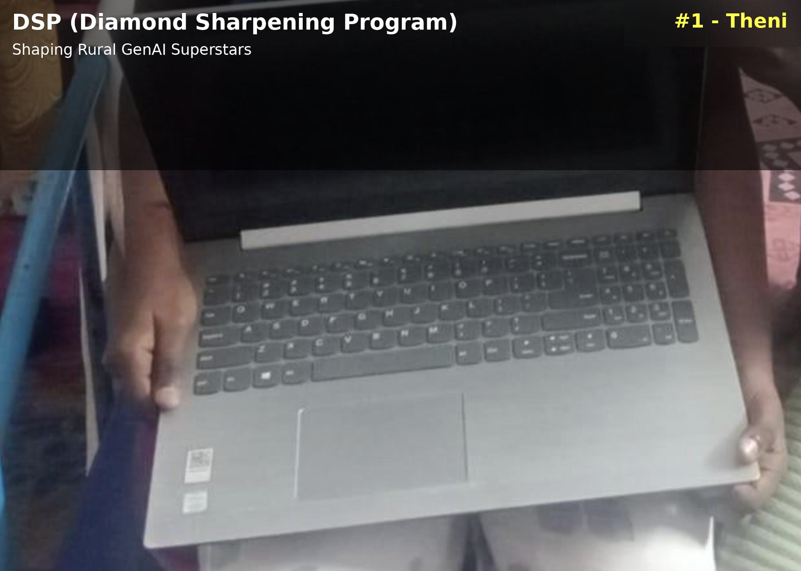

/ [Home](index.md)

## DSP - Diamond Sharpening Program

## Eligibility

- You must have 95+ marks in Science and Maths
- You must be from any Public School in Tamil Nadu
- You must be interested in Engineering (GenAI / CSE / AIDS / AIML / IT)
- You must be fluent in writing/speaking Tamil
- You must be willing to learn English quickly

## How do we train you?

- We provide a used laptop during your 11th and 12th grade
- Based on your learning and commitment, we will upgrade your laptop to a used MacBook after 2 years
- We will teach you Linux/Mac after your 12th grade
- We will train you for 6 years

## Fee Structure

- You pay the first 2 months of your salary after you get your first job (after Engineering)

## How to Apply

Email your details to info@kactii.com

---

## History:

### DSP#1 - Sarvadha

Hometown: Chinnamanur

District: Theni

We just discovered our Diamond #1 from Theni 💎

She’s only 13 years old, and already beginning her journey with Lubuntu on a sponsored laptop.

Huge thanks to Packiaraj for identifying this raw talent.

This is exactly why DSP exists —
to find brilliance where the world isn’t looking and give it the tools to shine.

Let’s give back to society. Let’s build the next generation.

--

As a part of our DSP (Diamond Sharpening Program), we discovered Sarvadha from Chinnamanur, Theni District, Tamil Nadu, India. Her father is an auto driver, and despite the humble background, Sarvadha has proven herself to be an exceptionally talented student. She has held the first rank consistently from 4th grade through 8th grade — an incredible streak of 60 months without ever missing the top spot.

A special thanks to our Director Packiaraj for identifying Sarvadha through the DSP program. She proudly became our very first DSP scholar — DSP#1.

We shipped Sarvadha a used Lubuntu OS-based laptop, and she is already learning Lubuntu during her vacation. A bright start to a bright future.

Who knows, Sarvadha might end up joining NASA in her future and transforming our earth. 

E4E - Education 4 Everyone.

---

*Note: This program is designed for students from public schools in Tamil Nadu who are interested in engineering and technology fields.*