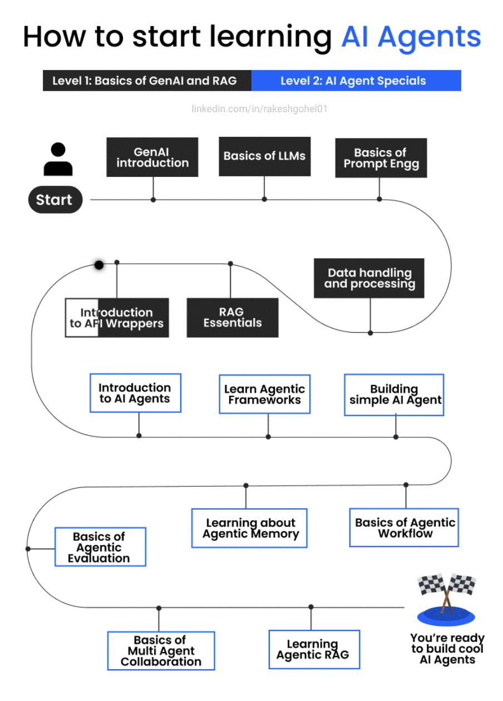

/ [Home](index.md)

## GenAI Roadmp

### Updated: Feb 19, 2025

### Level 1: Gen AI and RAG Foundations

1. Introduction to Generative AI
    - Generative AI for Everyone by Andrew Ng by DeepLearning.AI
    - [https://www.deeplearning.ai/courses/generative-ai-for-everyone/](https://www.deeplearning.ai/courses/generative-ai-for-everyone/)

2. Basics of Large Language Models (LLMs)
    - H2O ai Large Language Models (LLMs) - Level 1 by Coursera and H2O.ai
    - [https://www.coursera.org/learn/h2o-ai-large-language-models-llms-level-1](https://www.coursera.org/learn/h2o-ai-large-language-models-llms-level-1)

3. Fundamentals of Prompt Engineering
    - ChatGPT Prompt Engineering for Developers by DeepLearning.AI & OpenAI
    - [https://www.deeplearning.ai/short-courses/chatgpt-prompt-engineering-for-developers/](https://www.deeplearning.ai/short-courses/chatgpt-prompt-engineering-for-developers/)

4. Data Handling and Processing
    - Preprocessing Unstructured Data for LLM Apps by DeepLearning.AI & unstructured.io
    - [https://www.deeplearning.ai/short-courses/preprocessing-unstructured-data-for-llm-applications/](https://www.deeplearning.ai/short-courses/preprocessing-unstructured-data-for-llm-applications/)

5. Introduction to API Wrappers
    - Getting Started with Generative AI API Specialization by Coursera & Codio
    - [https://www.coursera.org/specializations/codio-generative-ai](https://www.coursera.org/specializations/codio-generative-ai)

6. Essentials of RAG
    - Introduction to Retrieval Augmented Generation (RAG) by Coursera
    - [https://www.coursera.org/learn/introduction-to-retrieval-augmented-generation-rag](https://www.coursera.org/learn/introduction-to-retrieval-augmented-generation-rag)

### Level 2: AI Agents Specialization

1. Introduction to AI Agents
    - Fundamentals of AI Agents Using RAG and LangChain by Coursera & IBM
    - [https://www.coursera.org/learn/fundamentals-of-ai-agents-using-rag-and-langchain](https://www.coursera.org/learn/fundamentals-of-ai-agents-using-rag-and-langchain)

2. Exploring Agent Frameworks
    - LangChain for LLM Application Development by DeepLearning.AI & LangChain
    - [https://www.deeplearning.ai/short-courses/langchain-for-llm-application-development/](https://www.deeplearning.ai/short-courses/langchain-for-llm-application-development/)

3. Building a Simple AI Agent
    - Build Autonomous AI Agents From Scratch With Python by Udemy
    - [https://www.udemy.com/course/build-autonomous-ai-agents-from-scratch-with-python/](https://www.udemy.com/course/build-autonomous-ai-agents-from-scratch-with-python/)

4. Understanding Agent Workflows
    - AI Agentic Design Patterns with AutoGen by Coursera & Microsoft
    - [https://www.coursera.org/projects/ai-agentic-design-patterns-with-autogen](https://www.coursera.org/projects/ai-agentic-design-patterns-with-autogen)

5. Learning About Agent Memory
    - LLMs as Operating Systems: Agent Memory by DeepLearning.AI & Letta
    - [https://www.deeplearning.ai/short-courses/llms-as-operating-systems-agent-memory/](https://www.deeplearning.ai/short-courses/llms-as-operating-systems-agent-memory/)

6. Evaluating Agent Performance
    - Building Intelligent Troubleshooting Agents by Coursera & Microsoft
    - [https://www.coursera.org/learn/building-intelligent-troubleshooting-agents](https://www.coursera.org/learn/building-intelligent-troubleshooting-agents)

7. Collaborating with Multiple Agents
    - Multi AI Agent Systems with crewAI by DeepLearning.AI & CrewAI
    - [https://www.deeplearning.ai/short-courses/multi-ai-agent-systems-with-crewai/](https://www.deeplearning.ai/short-courses/multi-ai-agent-systems-with-crewai/)

8. Implementing RAG in Agents
    - Building & Evaluating Advanced RAG Apps by DeepLearning.AI, LlamaIndex & TruEra
    - [https://www.deeplearning.ai/short-courses/building-evaluating-advanced-rag/](https://www.deeplearning.ai/short-courses/building-evaluating-advanced-rag/)

---------

## Set 2:

⏩ 𝗣𝘆𝘁𝗵𝗼𝗻 𝘀𝗸𝗶𝗹𝗹𝘀
✅ 𝗙𝗮𝘀𝘁𝗔𝗣𝗜 
– Build lightweight, production-ready APIs in no time
🔗 Video1: https://www.youtube.com/watch?v=iWS9ogMPOI0
🔗 Video2: https://fastapi.tiangolo.com/tutorial/

✅ 𝗔𝘀𝘆𝗻𝗰 𝗣𝗿𝗼𝗴𝗿𝗮𝗺𝗺𝗶𝗻𝗴 
– Speed up agents by handling multiple tasks asynchronously
🔗 Video: https://www.youtube.com/watch?v=Qb9s3UiMSTA

✅ 𝗣𝘆𝗱𝗮𝗻𝘁𝗶𝗰 
– Data validation and settings management that keeps your agent robust and reliable
🔗 Video: https://www.youtube.com/watch?v=XIdQ6gO3Anc

✅ 𝗟𝗼𝗴𝗴𝗶𝗻𝗴 
– Debugging agents without good logs? Nearly impossible.
🔗 Video: https://www.youtube.com/watch?v=9L77QExPmI0

✅ 𝗧𝗲𝘀𝘁𝗶𝗻𝗴 
– Unit and integration tests will save you when agents become complex.
🔗 Unit test: https://www.youtube.com/watch?v=YbpKMIUjvK8
🔗 Integration test: https://www.youtube.com/watch?v=7dgQRVqF1N0

✅ 𝗗𝗮𝘁𝗮𝗯𝗮𝘀𝗲 𝗠𝗮𝗻𝗮𝗴𝗲𝗺𝗲𝗻𝘁 (SQLAlchemy + Alembic) 
– Essential for RAG and storing agent memories
🔗 Video: https://www.youtube.com/watch?v=i9RX03zFDHU

⏩ 𝗥𝗔𝗚 𝘀𝗸𝗶𝗹𝗹𝘀
✅ 𝗨𝗻𝗱𝗲𝗿𝘀𝘁𝗮𝗻𝗱𝗶𝗻𝗴 𝗥𝗔𝗚 
– Learn what RAG is and why it matters
🔗 Video - https://www.youtube.com/watch?v=T-D1OfcDW1M

✅ 𝗧𝗲𝘅𝘁 𝗘𝗺𝗯𝗲𝗱𝗱𝗶𝗻𝗴𝘀 
– Foundation of search and retrieval in RAG systems
🔗 Video - https://www.youtube.com/watch?v=vlcQV4j2kTo

✅ 𝗩𝗲𝗰𝘁𝗼𝗿 𝗗𝗮𝘁𝗮𝗯𝗮𝘀𝗲 
– Store and retrieve embeddings efficiently
🔗 Video - https://www.youtube.com/watch?v=gl1r1XV0SLw

✅ 𝗖𝗵𝘂𝗻𝗸𝗶𝗻𝗴 𝗦𝘁𝗿𝗮𝘁𝗲𝗴𝗶𝗲𝘀 
– Split data smartly for better retrieval quality
🔗 Video - https://www.youtube.com/watch?v=8OJC21T2SL4

✅ 𝗥𝗔𝗚 𝘄𝗶𝘁𝗵 𝗣𝗼𝘀𝘁𝗴𝗿𝗲𝗦𝗤𝗟
– RAG without expensive vector DBs? Yes, possible.
🔗 Video - https://www.youtube.com/watch?v=hAdEuDBN57g

✅ 𝗥𝗔𝗚 𝘄𝗶𝘁𝗵 𝗟𝗮𝗻𝗴𝗖𝗵𝗮𝗶𝗻 
– Chain together retrieval, LLMs, and prompts easily
🔗 Video - https://www.youtube.com/watch?v=sVcwVQRHIc8

✅ 𝗥𝗔𝗚 𝗘𝘃𝗮𝗹𝘂𝗮𝘁𝗶𝗼𝗻𝘀 
– Know if your retrieval and answers are actually good
🔗 Video - https://www.youtube.com/watch?v=mEv-2Xnb_Wk 

✅ 𝗔𝗱𝘃𝗮𝗻𝗰𝗲𝗱 𝗥𝗔𝗚 𝗧𝗲𝗰𝗵𝗻𝗶𝗾𝘂𝗲𝘀 
– Fine-tune your RAG system for real-world performance
🔗 Video - https://www.youtube.com/watch?v=sGvXO7CVwc0 

⏩ 𝗔𝗜 𝗔𝗴𝗲𝗻𝘁 𝗙𝗿𝗮𝗺𝗲𝘄𝗼𝗿𝗸
✅ 𝗟𝗮𝗻𝗴𝗚𝗿𝗮𝗽𝗵 
– This one is mainly used in organisations to build production ready AI Agents.
🔗 Video - https://www.youtube.com/watch?v=jGg_1h0qzaM

✅ 𝗣𝗿𝗼𝗺𝗽𝘁 𝗲𝗻𝗴𝗶𝗻𝗲𝗲𝗿𝗶𝗻𝗴 𝗴𝘂𝗶𝗱𝗲 
– It's also good to follow specific guides from the LLM providers.
🔗 Link - https://github.com/dair-ai/Prompt-Engineering-Guide
