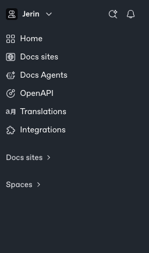
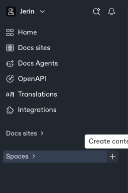
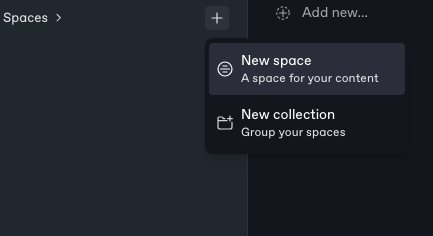
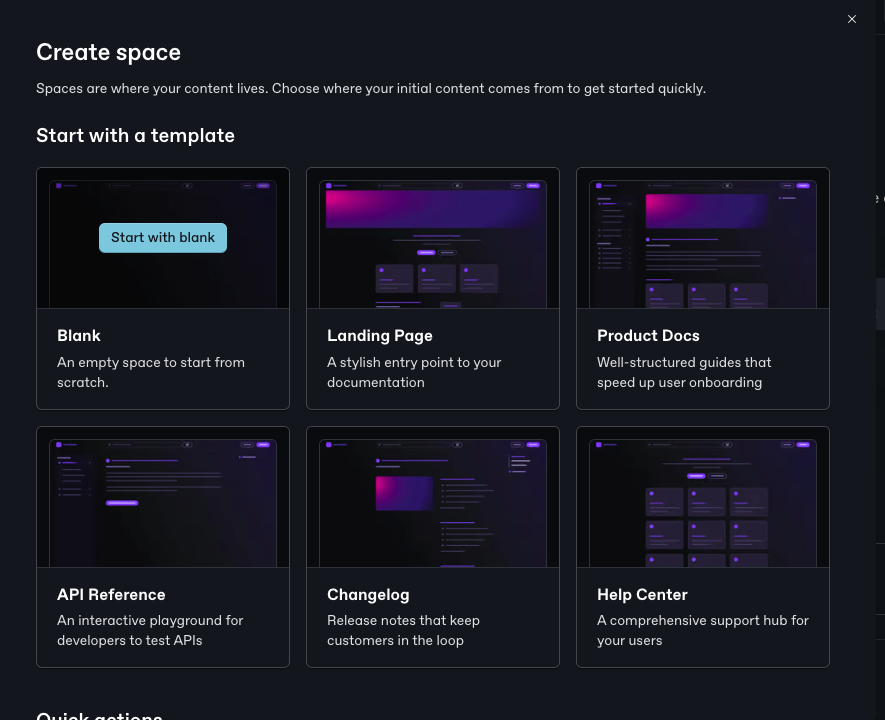
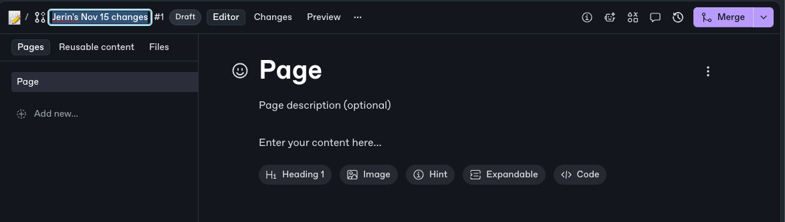
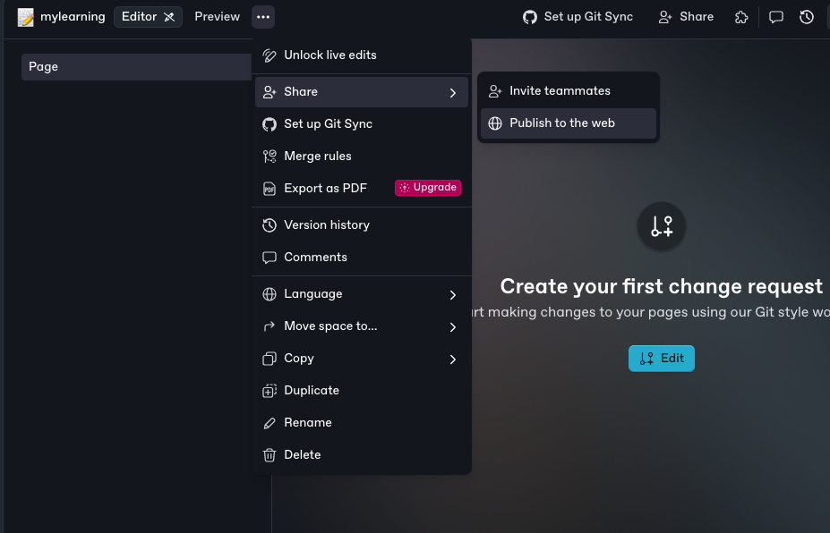
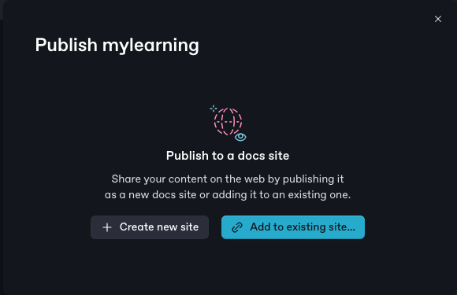
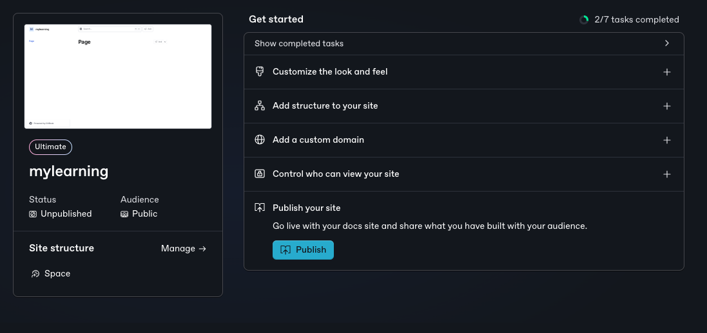
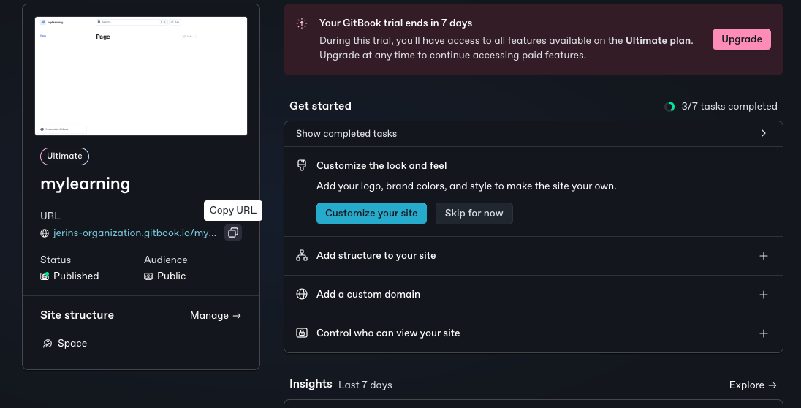

/ [Home](index.md)

# Gitbook

* Go to this link : https://app.gitbook.com/

* Sigin with your account (google or gitbook) 

* while login you will see field to name your organisation name the organisation with your name 

* once you login you will see the interface as shown in the image

* keep your cursor on spaces and click on create content and create a new space

* click on start with blank and continue to edit your space

* first rename your gitbook and start to edit your page 

## note

make sure you rename your note as "mylearning" no numbers no capital letters included

* once your are done editing the page and adding your notes you have to publish your site follow as shown in the image below

* then click on create new site as shown in the image 

* you will see the below image and click on publish and publish your site 

* once you are done with everything click on the link and you will see all your notes in the new tap

## That's all you are done with your gitbook like this you can create your notes in the gitbook 