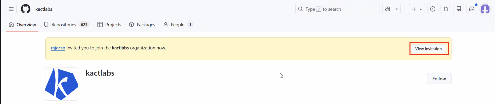
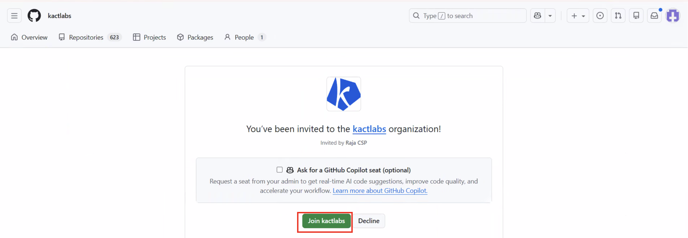

/ [Home](index.md)

## GitHub

**Note:** Git and GitHub things will come here

## How to create repository?
- TBD

## How to accept KactLabs Invitations
1. Simply visit `https://github.com/kactlabs` and you will see the `invitations` as in the screenshot

2. When clicking `invitations`, you will see `Join` button as in the screenshot. Click and you are good to go.

### File Changed 0 in PR

