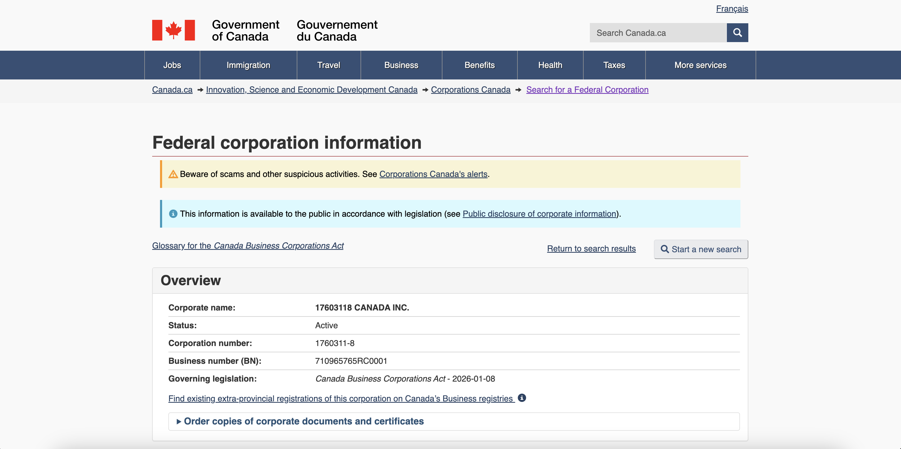
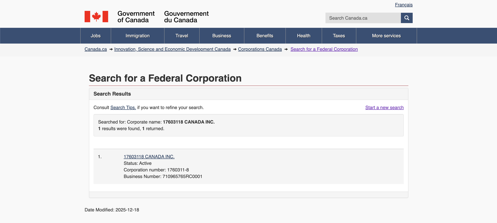

/ [Home](index.md)

## Incorporation


```
Entity Name: 17603118 CANADA INC.

Corporate name: 17603118 CANADA INC.
Corporation number: 1760311-8
Business number (BN): 710965765RC0001

OCN: 1001470316
Transaction Number: APP-A11003980507
```

### Links:
- [https://ised-isde.canada.ca/pkcbr-rec/en/search/results?search=%7B17603118%7D](https://ised-isde.canada.ca/pkcbr-rec/en/search/results?search=%7B17603118%7D)
- [https://ised-isde.canada.ca/cc/lgcy/fdrlCrpDtls.html?lang=eng&corpId=17603118](https://ised-isde.canada.ca/cc/lgcy/fdrlCrpDtls.html?lang=eng&corpId=17603118)
- [https://ised-isde.canada.ca/cc/lgcy/fdrlCrpDtls.html?p=0&corpId=17603118&crpNm=17603118%20CANADA%20INC.&crpNmbr=&bsNmbr=&cProv=&cStatus=&cAct=](https://ised-isde.canada.ca/cc/lgcy/fdrlCrpDtls.html?p=0&corpId=17603118&crpNm=17603118%20CANADA%20INC.&crpNmbr=&bsNmbr=&cProv=&cStatus=&cAct=)




