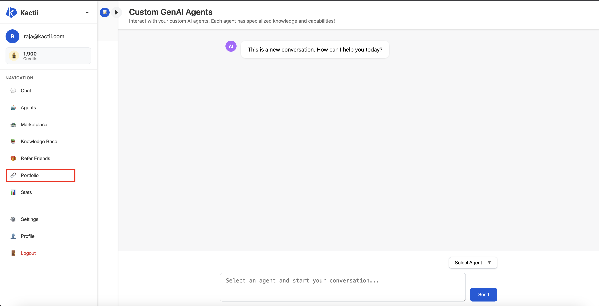
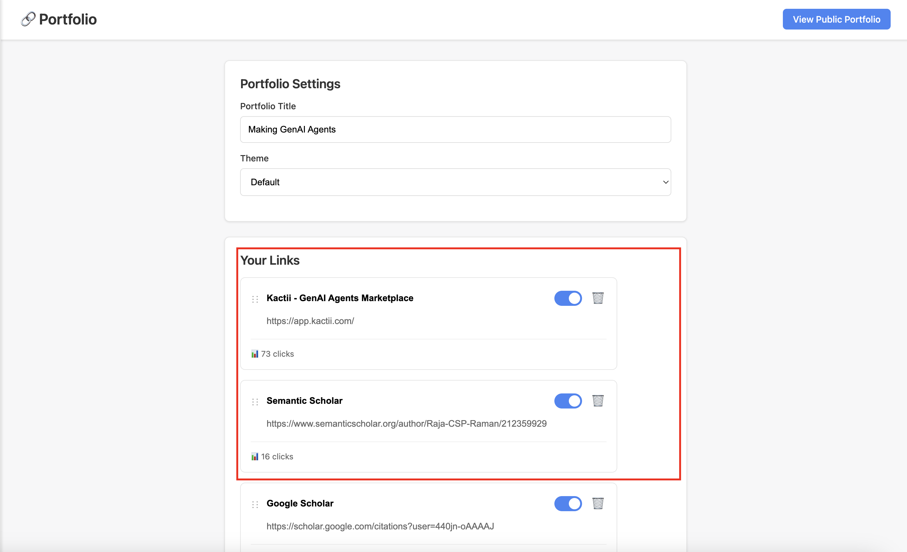
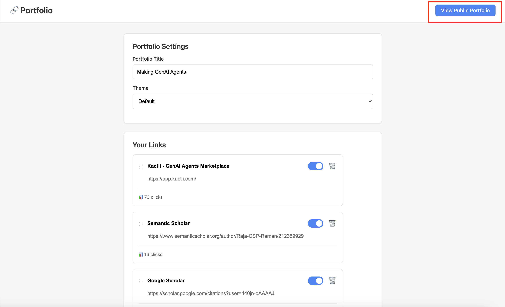
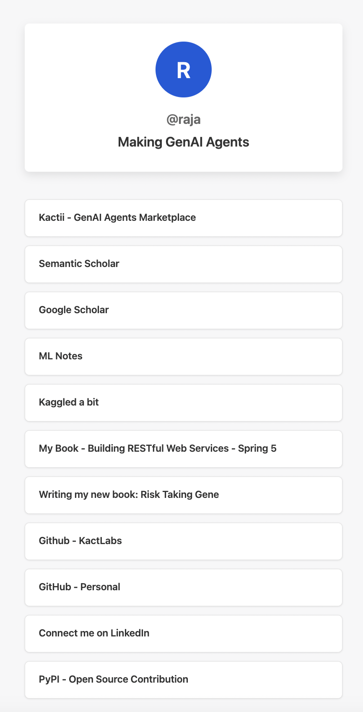

/ [Home](index.md)

## Link Bank

**Note:** Create your own Portfolio

1. Go to app.kactii [App - Kactii](https://app.kactii.com/login)

2. Login and go to `Portfolio` section as in screenshot


3. Start filling up your details like in screenshot


4. Once you are done adding all portfolio links, publish like in screenshot


### Recommended Portfolio Order:
```
1. LinkedIn
2. GitHub
3. PyNotes
4. GitBook - My Learning
5. Substack
6. Medium
7. Docker Hub
8. Ollama
9. Hugging Face
10. Kaggle
11. Github Personal Portfolio
12. GitLab
```

### Sample Fortfolio Screenshots


### Sample Link Banks:
* [https://app.kactii.com/c/raja](https://app.kactii.com/c/csp)
* [https://app.kactii.com/c/accsaikiran](https://app.kactii.com/c/accsaikiran)
* [https://app.kactii.com/c/stefina](https://app.kactii.com/c/stefina1109)
* [https://app.kactii.com/c/jerin](https://app.kactii.com/c/jerin1)
* [https://app.kactii.com/c/vishnu](https://app.kactii.com/c/vishnums7751)
* [https://app.kactii.com/c/meeran](https://app.kactii.com/c/meeran231422)
* [https://app.kactii.com/c/khadhija](https://app.kactii.com/c/khadhija984)
