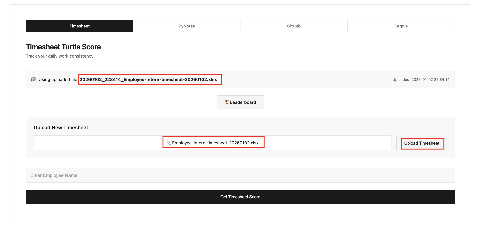
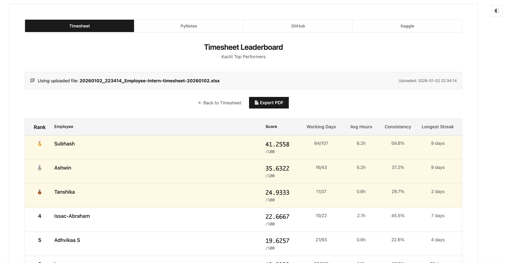
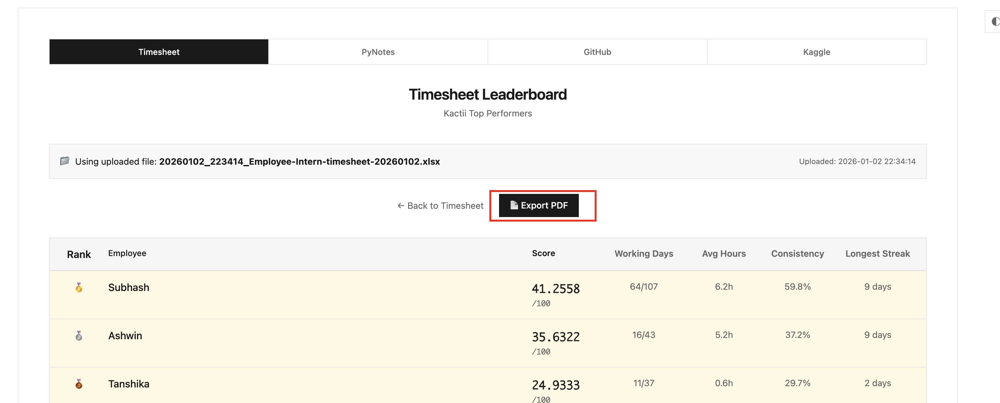
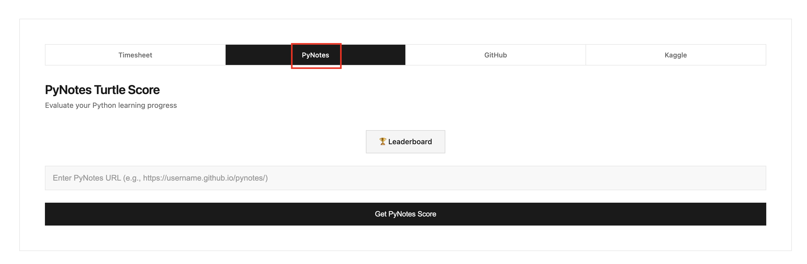
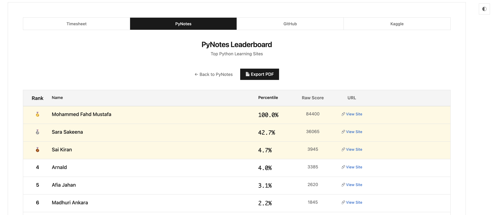
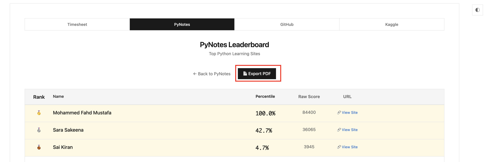

/ [Home](index.md)

## Kactiian Leaderboard

### 1. Clone the repo
```
git clone git@github.com:kactlabs/turtle-score.git

cd turtle-score

conda activate ml12

conda activate

pip install -r requirements.txt
```


### 2. Download this timehseet:


### 2.1. Save it in local in this format:
Employee-Intern-timesheet-20260102


### 3. Run server
```
python app.py
```
You will see the server like this:

#### 4. Upload the downloaded timesheet (as in screenshot)



#### 4. Run `Leaderboard` 
- You will get like this



#### 5. Export PDF (as in screenshot)

- Save the file


### 6. PyNotes Leaderboard
Go to the PyNotes section



### 7. You will get like this



### 8. Export PDF
