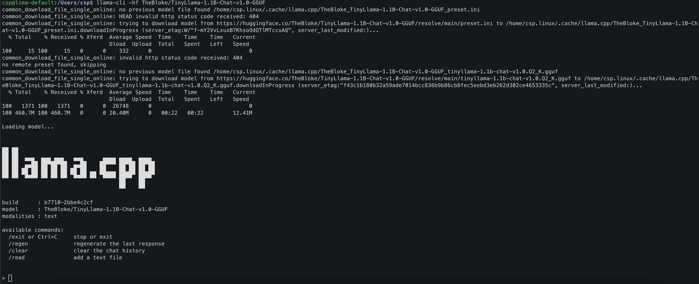
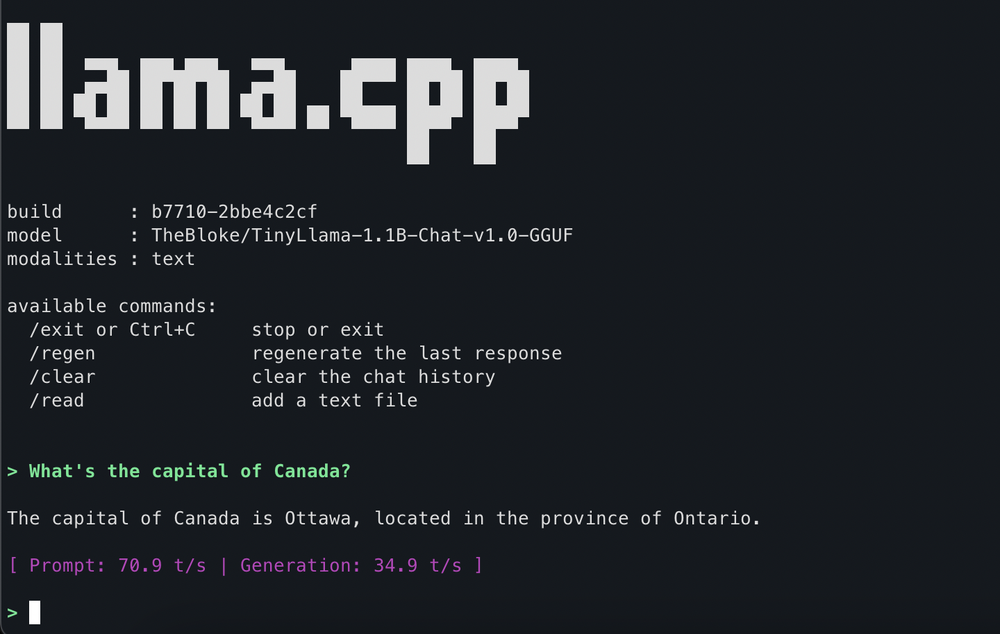

/ [Home](index.md)

## Lima - Linux Machines (on MacOS)


### Installation Commands
```
brew update
brew install lima
```


### Version Check
```
limactl --version
limactl version 2.0.3
```

### Lima start with default
```
limactl create

? Creating an instance "default" Proceed with the current configuration
INFO[0004] Attempting to download the image              arch=aarch64 digest="sha256:ec93c8acae3e7630daf723e31716703639417d86b87eb6962f3a0003d1045c15" location="https://cloud-images.ubuntu.com/releases/questing/release-20251212/ubuntu-25.10-server-cloudimg-arm64.img"
INFO[0004] Using cache "/Users/csp/Library/Caches/lima/download/by-url-sha256/e95edb2e1556b6c333b74f757283fe6679c2628e6c17f4485beb3a8575ac22da/data"
INFO[0004] Converting "/Users/csp/.lima/default/basedisk" (qcow2) to a raw disk "/Users/csp/.lima/default/diffdisk"
3.50 GiB / 3.50 GiB [---------------------------------------] 100.00% 1.50 GiB/s
INFO[0006] Expanding to 100GiB
INFO[0006] Attempting to download the nerdctl archive    arch=aarch64 digest="sha256:2c4b97312acd41c4dfe80db6e82592367b3862b5db4c51ce67a6d79bf6ee00ee" location="https://github.com/containerd/nerdctl/releases/download/v2.2.1/nerdctl-full-2.2.1-linux-arm64.tar.gz"
INFO[0006] Using cache "/Users/csp/Library/Caches/lima/download/by-url-sha256/6a0892ae7e07b69f60228bcfeb96e6c7bd44bd83a6cbfd1c680fced75e550ab0/data"
INFO[0006] Run `limactl start default` to start the instance.
```

### 
```
limactl start default

INFO[0000] Using the existing instance "default"
INFO[0000] Starting the instance "default" with internal VM driver "vz"
INFO[0000] [hostagent] hostagent socket created at /Users/csp/.lima/default/ha.sock
INFO[0000] [hostagent] Starting VZ (hint: to watch the boot progress, see "/Users/csp/.lima/default/serial*.log")
INFO[0000] [hostagent] [VZ] - vm state change: running
INFO[0008] [hostagent] Started vsock forwarder: 127.0.0.1:59403 -> vsock:22 on VM
INFO[0008] [hostagent] Detected SSH server is listening on the vsock port; changed 127.0.0.1:59403 to proxy for the vsock port
INFO[0009] SSH Local Port: 59403
INFO[0008] [hostagent] Waiting for the essential requirement 1 of 3: "ssh"
INFO[0008] [hostagent] The essential requirement 1 of 3 is satisfied
INFO[0008] [hostagent] Waiting for the essential requirement 2 of 3: "user session is ready for ssh"
INFO[0019] [hostagent] Waiting for the essential requirement 2 of 3: "user session is ready for ssh"
INFO[0019] [hostagent] The essential requirement 2 of 3 is satisfied
INFO[0019] [hostagent] Waiting for the essential requirement 3 of 3: "Explicitly start ssh ControlMaster"
INFO[0020] [hostagent] The essential requirement 3 of 3 is satisfied
INFO[0020] [hostagent] Waiting for the optional requirement 1 of 2: "systemd must be available"
INFO[0020] [hostagent] The optional requirement 1 of 2 is satisfied
INFO[0020] [hostagent] Waiting for the optional requirement 2 of 2: "containerd binaries to be installed"
INFO[0020] [hostagent] Guest agent is running
INFO[0020] [hostagent] Not forwarding TCP 127.0.0.53:53
INFO[0020] [hostagent] Not forwarding TCP 0.0.0.0:22
INFO[0020] [hostagent] Not forwarding TCP 127.0.0.54:53
INFO[0020] [hostagent] Not forwarding TCP [::]:22
INFO[0020] [hostagent] Forwarding UDP from 0.0.0.0:5353 to 127.0.0.1:5353
INFO[0020] [hostagent] Not forwarding UDP 127.0.0.54:53
INFO[0020] [hostagent] Not forwarding UDP 127.0.0.53:53
INFO[0020] [hostagent] Not forwarding UDP 192.168.5.15:68
INFO[0020] [hostagent] Forwarding UDP from 127.0.0.1:323 to 127.0.0.1:323
INFO[0020] [hostagent] Forwarding UDP from [::]:5353 to 127.0.0.1:5353
INFO[0020] [hostagent] Forwarding UDP from [::1]:323 to 127.0.0.1:323
INFO[0020] [hostagent] Not forwarding UDP 127.0.0.1:5353
INFO[0020] [hostagent] Not forwarding UDP 127.0.0.1:5353
INFO[0020] [hostagent] Not forwarding UDP 0.0.0.0:323
INFO[0020] [hostagent] Not forwarding UDP 127.0.0.1:323
INFO[0026] [hostagent] The optional requirement 2 of 2 is satisfied
INFO[0026] [hostagent] Waiting for the guest agent to be running
INFO[0026] [hostagent] Waiting for the final requirement 1 of 1: "boot scripts must have finished"
INFO[0026] [hostagent] Forwarding TCP from 127.0.0.1:42057 to 127.0.0.1:42057
INFO[0038] [hostagent] The final requirement 1 of 1 is satisfied
INFO[0039] READY. Run `lima` to open the shell.
```

###
```
lima

csp@lima-default:/Users/csp$

csp@lima-default:/Users/csp$ lsb_release -a
No LSB modules are available.
Distributor ID:	Ubuntu
Description:	Ubuntu 25.10
Release:	25.10
Codename:	questing


```

### Inside Lima-Ubuntu
```
sudo apt update

Hit:1 http://ports.ubuntu.com/ubuntu-ports questing InRelease
..
Hit:4 http://ports.ubuntu.com/ubuntu-ports questing-security InRelease
38 packages can be upgraded. Run 'apt list --upgradable' to see them.

sudo apt install -y build-essential curl file git

--

/bin/bash -c "$(curl -fsSL https://raw.githubusercontent.com/Homebrew/install/HEAD/install.sh)"

--

## verify
ls /home/linuxbrew/.linuxbrew

## you should see like this
Caskroom  Cellar  Frameworks  Homebrew  bin  etc  include  lib  opt  sbin  share  var

--


# check your default shell
echo $0
/bin/bash

# if bash, use this:
echo 'eval "$(/home/linuxbrew/.linuxbrew/bin/brew shellenv)"' >> ~/.bashrc
eval "$(/home/linuxbrew/.linuxbrew/bin/brew shellenv)"

--

# Check version
brew --version
Homebrew 5.0.10

--
# check with doctor
brew doctor
Your system is ready to brew.

-- 

# install `hello`
brew install hello

# test hello
hello
(You should see like this:)
Hello, world!
```


### Install Llam.cpp on Lima-Ubuntu
```
brew install llama.cpp

sudo apt install -y   build-essential   cmake   git   curl   pkg-config

export HF_TOKEN=(add your hf token)

# verify token
echo $HF_TOKEN

# Run a sample model
llama-cli -hf TheBloke/TinyLlama-1.1B-Chat-v1.0-GGUF
(You should see something like in this image)
```




### Sample Question on Llama



### Install Python on Lima+Ubuntu
```
sudo apt update
sudo apt install -y \
  build-essential \
  libssl-dev \
  zlib1g-dev \
  libbz2-dev \
  libreadline-dev \
  libsqlite3-dev \
  libffi-dev \
  liblzma-dev \
  tk-dev \
  uuid-dev \
  ca-certificates \
  curl \
  xz-utils

curl https://pyenv.run | bash

# open bashrc
nano ~/.bashrc

# add these 4 lines in bashrc
export PYENV_ROOT="$HOME/.pyenv"
export PATH="$PYENV_ROOT/bin:$PATH"

eval "$(pyenv init --path)"
eval "$(pyenv init -)"

# source
source ~/.bashrc

# check pyenv
pyenv --version
pyenv 2.6.18


# Enable
export PYTHON_CONFIGURE_OPTS="--enable-shared"

pyenv install 3.12.1
# You should see like this
Downloading Python-3.12.1.tar.xz...
-> https://www.python.org/ftp/python/3.12.1/Python-3.12.1.tar.xz
Installing Python-3.12.1...
Installed Python-3.12.1 to /home/csp.linux/.pyenv/versions/3.12.1

pyenv global 3.12.1

which pyenv
# You should see like this
/home/csp.linux/.pyenv/bin/pyenv

pyenv --version
pyenv 2.6.18

python --version
# You should see like this
Python 3.12.1
```


### List VM Instances
```
limactl list

NAME            STATUS     SSH                VMTYPE    ARCH       CPUS    MEMORY    DISK      DIR
default         Running    127.0.0.1:55058    vz        aarch64    4       4GiB      100GiB    ~/.lima/default
ubuntu-20.04    Running    127.0.0.1:55585    vz        aarch64    4       4GiB      100GiB    ~/.lima/ubuntu-20.04
```


### Stop VM Instance
```
limactl stop ubuntu-20.04

INFO[0000] Sending SIGINT to hostagent process 78861
INFO[0000] Waiting for the host agent and the driver processes to shut down
INFO[0000] [hostagent] Received SIGINT, shutting down the host agent
INFO[0000] [hostagent] Shutting down the host agent
INFO[0000] [hostagent] Shutting down VZ
INFO[0002] [hostagent] [VZ] - vm state change: stopped
ERRO[0002] [hostagent] accept tcp 127.0.0.1:55585: use of closed network connection
INFO[0003] Waiting for the instance to shut down
INFO[0004] The instance ubuntu-20.04 has shut down
```

### Delete VM Instance
```
limactl delete ubuntu-20.04

INFO[0000] The vz driver process seems already stopped
INFO[0000] The host agent process seems already stopped
INFO[0000] Removing *.pid *.sock *.tmp under "/Users/csp/.lima/ubuntu-20.04"
INFO[0000] Deleted "ubuntu-20.04" ("/Users/csp/.lima/ubuntu-20.04")
```

### Force Delete VM Instance
```
limactl delete --force default

INFO[0000] Sending SIGKILL to the vz driver process 78334
INFO[0000] Sending SIGKILL to the host agent process 78334
INFO[0000] Removing *.pid *.sock *.tmp under "/Users/csp/.lima/default"
INFO[0000] Removing "/Users/csp/.lima/default/default_ep.sock"
INFO[0000] Removing "/Users/csp/.lima/default/default_fd.sock"
INFO[0000] Removing "/Users/csp/.lima/default/ha.pid"
INFO[0000] Removing "/Users/csp/.lima/default/ha.sock"
INFO[0000] Removing "/Users/csp/.lima/default/ssh.sock"
INFO[0000] Removing "/Users/csp/.lima/default/vz.pid"
INFO[0000] Deleted "default" ("/Users/csp/.lima/default")
```


### Verify Empty Instance List
```
limactl list
WARN[0000] No instance found. Run `limactl create` to create an instance.
```


### System Information and Available Templates
```
limactl info

{
    "version": "2.0.3",
    "templates": [
        {
            "name": "_default/mounts",
            "location": "/opt/homebrew/share/lima/templates/_default/mounts.yaml"
        },
        {
            "name": "_images/almalinux-10",
            "location": "/opt/homebrew/share/lima/templates/_images/almalinux-10.yaml"
        },
        {
            "name": "_images/almalinux-8",
            "location": "/opt/homebrew/share/lima/templates/_images/almalinux-8.yaml"
        },
        {
            "name": "_images/almalinux-9",
            "location": "/opt/homebrew/share/lima/templates/_images/almalinux-9.yaml"
        },
        {
            "name": "_images/almalinux-kitten-10",
            "location": "/opt/homebrew/share/lima/templates/_images/almalinux-kitten-10.yaml"
        },
        {
            "name": "_images/alpine",
            "location": "/opt/homebrew/share/lima/templates/_images/alpine.yaml"
        },
        {
            "name": "_images/alpine-iso",
            "location": "/opt/homebrew/share/lima/templates/_images/alpine-iso.yaml"
        },
        {
            "name": "_images/archlinux",
            "location": "/opt/homebrew/share/lima/templates/_images/archlinux.yaml"
        },
        {
            "name": "_images/centos-stream-10",
            "location": "/opt/homebrew/share/lima/templates/_images/centos-stream-10.yaml"
        },
        {
            "name": "_images/centos-stream-9",
            "location": "/opt/homebrew/share/lima/templates/_images/centos-stream-9.yaml"
        },
        {
            "name": "_images/debian-11",
            "location": "/opt/homebrew/share/lima/templates/_images/debian-11.yaml"
        },
        {
            "name": "_images/debian-12",
            "location": "/opt/homebrew/share/lima/templates/_images/debian-12.yaml"
        },
        {
            "name": "_images/debian-13",
            "location": "/opt/homebrew/share/lima/templates/_images/debian-13.yaml"
        },
        {
            "name": "_images/fedora",
            "location": "/opt/homebrew/share/lima/templates/_images/fedora.yaml"
        },
        {
            "name": "_images/fedora-41",
            "location": "/opt/homebrew/share/lima/templates/_images/fedora-41.yaml"
        },
        {
            "name": "_images/fedora-42",
            "location": "/opt/homebrew/share/lima/templates/_images/fedora-42.yaml"
        },
        {
            "name": "_images/fedora-43",
            "location": "/opt/homebrew/share/lima/templates/_images/fedora-43.yaml"
        },
        {
            "name": "_images/opensuse-leap",
            "location": "/opt/homebrew/share/lima/templates/_images/opensuse-leap.yaml"
        },
        {
            "name": "_images/opensuse-leap-15",
            "location": "/opt/homebrew/share/lima/templates/_images/opensuse-leap-15.yaml"
        },
        {
            "name": "_images/opensuse-leap-16",
            "location": "/opt/homebrew/share/lima/templates/_images/opensuse-leap-16.yaml"
        },
        {
            "name": "_images/oraclelinux-10",
            "location": "/opt/homebrew/share/lima/templates/_images/oraclelinux-10.yaml"
        },
        {
            "name": "_images/oraclelinux-8",
            "location": "/opt/homebrew/share/lima/templates/_images/oraclelinux-8.yaml"
        },
        {
            "name": "_images/oraclelinux-9",
            "location": "/opt/homebrew/share/lima/templates/_images/oraclelinux-9.yaml"
        },
        {
            "name": "_images/rocky-10",
            "location": "/opt/homebrew/share/lima/templates/_images/rocky-10.yaml"
        },
        {
            "name": "_images/rocky-8",
            "location": "/opt/homebrew/share/lima/templates/_images/rocky-8.yaml"
        },
        {
            "name": "_images/rocky-9",
            "location": "/opt/homebrew/share/lima/templates/_images/rocky-9.yaml"
        },
        {
            "name": "_images/ubuntu",
            "location": "/opt/homebrew/share/lima/templates/_images/ubuntu.yaml"
        },
        {
            "name": "_images/ubuntu-20.04",
            "location": "/opt/homebrew/share/lima/templates/_images/ubuntu-20.04.yaml"
        },
        {
            "name": "_images/ubuntu-22.04",
            "location": "/opt/homebrew/share/lima/templates/_images/ubuntu-22.04.yaml"
        },
        {
            "name": "_images/ubuntu-24.04",
            "location": "/opt/homebrew/share/lima/templates/_images/ubuntu-24.04.yaml"
        },
        {
            "name": "_images/ubuntu-24.10",
            "location": "/opt/homebrew/share/lima/templates/_images/ubuntu-24.10.yaml"
        },
        {
            "name": "_images/ubuntu-25.04",
            "location": "/opt/homebrew/share/lima/templates/_images/ubuntu-25.04.yaml"
        },
        {
            "name": "_images/ubuntu-25.10",
            "location": "/opt/homebrew/share/lima/templates/_images/ubuntu-25.10.yaml"
        },
        {
            "name": "_images/ubuntu-lts",
            "location": "/opt/homebrew/share/lima/templates/_images/ubuntu-lts.yaml"
        },
        {
            "name": "almalinux",
            "location": "/opt/homebrew/share/lima/templates/almalinux.yaml"
        },
        {
            "name": "almalinux-10",
            "location": "/opt/homebrew/share/lima/templates/almalinux-10.yaml"
        },
        {
            "name": "almalinux-8",
            "location": "/opt/homebrew/share/lima/templates/almalinux-8.yaml"
        },
        {
            "name": "almalinux-9",
            "location": "/opt/homebrew/share/lima/templates/almalinux-9.yaml"
        },
        {
            "name": "almalinux-kitten",
            "location": "/opt/homebrew/share/lima/templates/almalinux-kitten.yaml"
        },
        {
            "name": "almalinux-kitten-10",
            "location": "/opt/homebrew/share/lima/templates/almalinux-kitten-10.yaml"
        },
        {
            "name": "alpine",
            "location": "/opt/homebrew/share/lima/templates/alpine.yaml"
        },
        {
            "name": "alpine-iso",
            "location": "/opt/homebrew/share/lima/templates/alpine-iso.yaml"
        },
        {
            "name": "apptainer",
            "location": "/opt/homebrew/share/lima/templates/apptainer.yaml"
        },
        {
            "name": "apptainer-rootful",
            "location": "/opt/homebrew/share/lima/templates/apptainer-rootful.yaml"
        },
        {
            "name": "archlinux",
            "location": "/opt/homebrew/share/lima/templates/archlinux.yaml"
        },
        {
            "name": "buildkit",
            "location": "/opt/homebrew/share/lima/templates/buildkit.yaml"
        },
        {
            "name": "centos-stream",
            "location": "/opt/homebrew/share/lima/templates/centos-stream.yaml"
        },
        {
            "name": "centos-stream-10",
            "location": "/opt/homebrew/share/lima/templates/centos-stream-10.yaml"
        },
        {
            "name": "centos-stream-9",
            "location": "/opt/homebrew/share/lima/templates/centos-stream-9.yaml"
        },
        {
            "name": "debian",
            "location": "/opt/homebrew/share/lima/templates/debian.yaml"
        },
        {
            "name": "debian-12",
            "location": "/opt/homebrew/share/lima/templates/debian-12.yaml"
        },
        {
            "name": "debian-13",
            "location": "/opt/homebrew/share/lima/templates/debian-13.yaml"
        },
        {
            "name": "default",
            "location": "/opt/homebrew/share/lima/templates/default.yaml"
        },
        {
            "name": "docker",
            "location": "/opt/homebrew/share/lima/templates/docker.yaml"
        },
        {
            "name": "docker-rootful",
            "location": "/opt/homebrew/share/lima/templates/docker-rootful.yaml"
        },
        {
            "name": "experimental/alsa",
            "location": "/opt/homebrew/share/lima/templates/experimental/alsa.yaml"
        },
        {
            "name": "experimental/debian-sid",
            "location": "/opt/homebrew/share/lima/templates/experimental/debian-sid.yaml"
        },
        {
            "name": "experimental/gentoo",
            "location": "/opt/homebrew/share/lima/templates/experimental/gentoo.yaml"
        },
        {
            "name": "experimental/opensuse-tumbleweed",
            "location": "/opt/homebrew/share/lima/templates/experimental/opensuse-tumbleweed.yaml"
        },
        {
            "name": "experimental/rke2",
            "location": "/opt/homebrew/share/lima/templates/experimental/rke2.yaml"
        },
        {
            "name": "experimental/u7s",
            "location": "/opt/homebrew/share/lima/templates/experimental/u7s.yaml"
        },
        {
            "name": "experimental/ubuntu-26.04",
            "location": "/opt/homebrew/share/lima/templates/experimental/ubuntu-26.04.yaml"
        },
        {
            "name": "experimental/ubuntu-next",
            "location": "/opt/homebrew/share/lima/templates/experimental/ubuntu-next.yaml"
        },
        {
            "name": "experimental/vnc",
            "location": "/opt/homebrew/share/lima/templates/experimental/vnc.yaml"
        },
        {
            "name": "experimental/wsl2",
            "location": "/opt/homebrew/share/lima/templates/experimental/wsl2.yaml"
        },
        {
            "name": "faasd",
            "location": "/opt/homebrew/share/lima/templates/faasd.yaml"
        },
        {
            "name": "fedora",
            "location": "/opt/homebrew/share/lima/templates/fedora.yaml"
        },
        {
            "name": "fedora-41",
            "location": "/opt/homebrew/share/lima/templates/fedora-41.yaml"
        },
        {
            "name": "fedora-42",
            "location": "/opt/homebrew/share/lima/templates/fedora-42.yaml"
        },
        {
            "name": "fedora-43",
            "location": "/opt/homebrew/share/lima/templates/fedora-43.yaml"
        },
        {
            "name": "k0s",
            "location": "/opt/homebrew/share/lima/templates/k0s.yaml"
        },
        {
            "name": "k3s",
            "location": "/opt/homebrew/share/lima/templates/k3s.yaml"
        },
        {
            "name": "k8s",
            "location": "/opt/homebrew/share/lima/templates/k8s.yaml"
        },
        {
            "name": "linuxbrew",
            "location": "/opt/homebrew/share/lima/templates/linuxbrew.yaml"
        },
        {
            "name": "opensuse",
            "location": "/opt/homebrew/share/lima/templates/opensuse.yaml"
        },
        {
            "name": "opensuse-leap",
            "location": "/opt/homebrew/share/lima/templates/opensuse-leap.yaml"
        },
        {
            "name": "opensuse-leap-15",
            "location": "/opt/homebrew/share/lima/templates/opensuse-leap-15.yaml"
        },
        {
            "name": "opensuse-leap-16",
            "location": "/opt/homebrew/share/lima/templates/opensuse-leap-16.yaml"
        },
        {
            "name": "oraclelinux",
            "location": "/opt/homebrew/share/lima/templates/oraclelinux.yaml"
        },
        {
            "name": "oraclelinux-10",
            "location": "/opt/homebrew/share/lima/templates/oraclelinux-10.yaml"
        },
        {
            "name": "oraclelinux-8",
            "location": "/opt/homebrew/share/lima/templates/oraclelinux-8.yaml"
        },
        {
            "name": "oraclelinux-9",
            "location": "/opt/homebrew/share/lima/templates/oraclelinux-9.yaml"
        },
        {
            "name": "podman",
            "location": "/opt/homebrew/share/lima/templates/podman.yaml"
        },
        {
            "name": "podman-rootful",
            "location": "/opt/homebrew/share/lima/templates/podman-rootful.yaml"
        },
        {
            "name": "rocky",
            "location": "/opt/homebrew/share/lima/templates/rocky.yaml"
        },
        {
            "name": "rocky-10",
            "location": "/opt/homebrew/share/lima/templates/rocky-10.yaml"
        },
        {
            "name": "rocky-8",
            "location": "/opt/homebrew/share/lima/templates/rocky-8.yaml"
        },
        {
            "name": "rocky-9",
            "location": "/opt/homebrew/share/lima/templates/rocky-9.yaml"
        },
        {
            "name": "ubuntu",
            "location": "/opt/homebrew/share/lima/templates/ubuntu.yaml"
        },
        {
            "name": "ubuntu-20.04",
            "location": "/opt/homebrew/share/lima/templates/ubuntu-20.04.yaml"
        },
        {
            "name": "ubuntu-22.04",
            "location": "/opt/homebrew/share/lima/templates/ubuntu-22.04.yaml"
        },
        {
            "name": "ubuntu-24.04",
            "location": "/opt/homebrew/share/lima/templates/ubuntu-24.04.yaml"
        },
        {
            "name": "ubuntu-24.10",
            "location": "/opt/homebrew/share/lima/templates/ubuntu-24.10.yaml"
        },
        {
            "name": "ubuntu-25.04",
            "location": "/opt/homebrew/share/lima/templates/ubuntu-25.04.yaml"
        },
        {
            "name": "ubuntu-25.10",
            "location": "/opt/homebrew/share/lima/templates/ubuntu-25.10.yaml"
        },
        {
            "name": "ubuntu-lts",
            "location": "/opt/homebrew/share/lima/templates/ubuntu-lts.yaml"
        }
    ],
    "defaultTemplate": {
        "base": [
            {
                "url": "template:_images/ubuntu"
            },
            {
                "url": "template:_default/mounts"
            }
        ],
        "minimumLimaVersion": "2.0.0",
        "vmOpts": {
            "qemu": {
                "cpuType": null,
                "minimumVersion": null
            },
            "vz": {
                "diskImageFormat": null,
                "rosetta": {
                    "binfmt": null,
                    "enabled": null
                }
            }
        },
        "os": "Linux",
        "arch": "aarch64",
        "cpus": 4,
        "memory": "4GiB",
        "disk": "100GiB",
        "mountInotify": false,
        "ssh": {
            "localPort": 0,
            "loadDotSSHPubKeys": false,
            "forwardAgent": false,
            "forwardX11": false,
            "forwardX11Trusted": false
        },
        "firmware": {
            "legacyBIOS": false
        },
        "audio": {
            "device": ""
        },
        "video": {
            "display": "none",
            "vnc": {}
        },
        "upgradePackages": false,
        "containerd": {
            "system": false,
            "user": true,
            "archives": [
                {
                    "location": "https://github.com/containerd/nerdctl/releases/download/v2.2.1/nerdctl-full-2.2.1-linux-amd64.tar.gz",
                    "arch": "x86_64",
                    "digest": "sha256:cf4720a290f098f1a66d34a1b2e1d3736c9014fceca737861fb7a069c66c01c2"
                },
                {
                    "location": "https://github.com/containerd/nerdctl/releases/download/v2.2.1/nerdctl-full-2.2.1-linux-arm64.tar.gz",
                    "arch": "aarch64",
                    "digest": "sha256:2c4b97312acd41c4dfe80db6e82592367b3862b5db4c51ce67a6d79bf6ee00ee"
                }
            ]
        },
        "guestInstallPrefix": "/usr/local",
        "hostResolver": {
            "enabled": true,
            "ipv6": false
        },
        "propagateProxyEnv": true,
        "caCerts": {
            "removeDefaults": false
        },
        "rosetta": {},
        "plain": false,
        "timezone": "America/Toronto",
        "nestedVirtualization": false,
        "user": {
            "name": "csp",
            "comment": "Raja CSP Raman",
            "home": "/home/csp.linux",
            "shell": "/bin/bash",
            "uid": 501
        }
    },
    "limaHome": "/Users/csp/.lima",
    "vmTypes": [
        "krunkit",
        "qemu",
        "vz"
    ],
    "vmTypesEx": {
        "krunkit": {
            "location": "/opt/homebrew/Cellar/lima/2.0.3/libexec/lima/lima-driver-krunkit"
        },
        "qemu": {
            "location": "internal"
        },
        "vz": {
            "location": "internal"
        }
    },
    "guestAgents": {
        "aarch64": {
            "location": "/opt/homebrew/share/lima/lima-guestagent.Linux-aarch64.gz"
        }
    },
    "shellEnvBlock": [
        "BASH*",
        "DISPLAY",
        "DYLD_*",
        "EUID",
        "FPATH",
        "GID",
        "GROUP",
        "HOME",
        "HOSTNAME",
        "LD_*",
        "LOGNAME",
        "OLDPWD",
        "PATH",
        "PWD",
        "SHELL",
        "SHLVL",
        "SSH_*",
        "TERM",
        "TERMINFO",
        "TMPDIR",
        "UID",
        "USER",
        "XAUTHORITY",
        "XDG_*",
        "ZDOTDIR",
        "ZSH*",
        "_*"
    ],
    "hostOS": "darwin",
    "hostArch": "aarch64",
    "identityFile": "/Users/csp/.lima/_config/user",
    "plugins": [
        {
            "name": "mcp",
            "path": "/opt/homebrew/Cellar/lima/2.0.3/libexec/lima/limactl-mcp"
        }
    ],
    "libexecPaths": [
        "/opt/homebrew/Cellar/lima/2.0.3/libexec/lima"
    ],
    "sharePaths": [
        "/opt/homebrew/share/lima",
        "/opt/homebrew/Cellar/lima/2.0.3/share/lima"
    ]
}
```


```
brew uninstall lima
Uninstalling /opt/homebrew/Cellar/lima/2.0.3... (117 files, 77.8MB)
```

