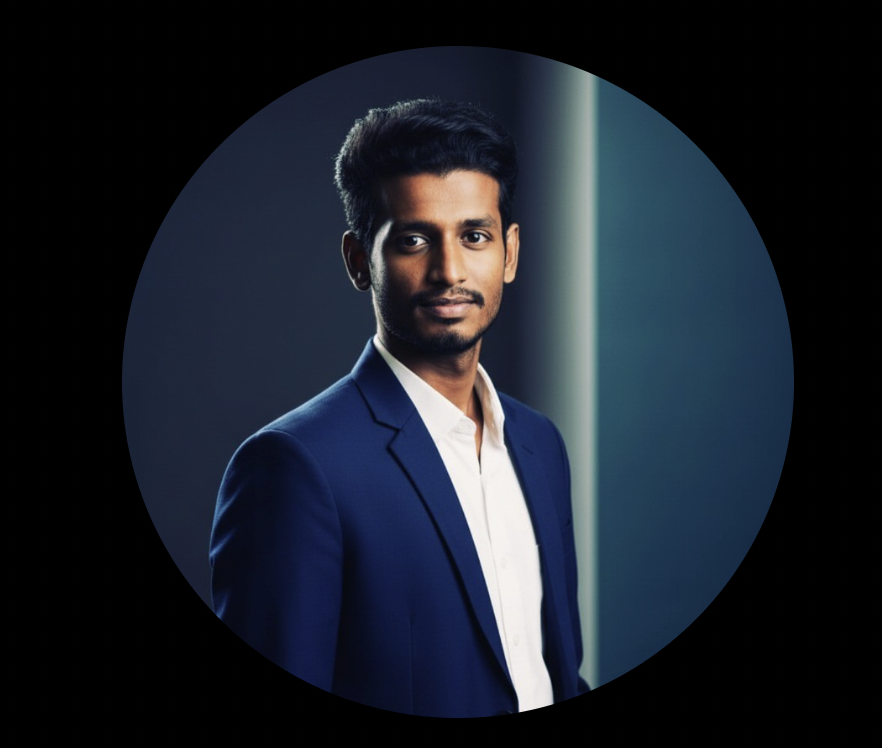

/ [Home](index.md)


## Linkedin Profile Update


### Go to Gemini
 * [Gemini](https://gemini.google.com/app?is_sa=1&is_sa=1&android-min-version=301356232&ios-min-version=322.0&campaign_id=bkws&utm_source=sem&utm_source=google&utm_medium=paid-media&utm_medium=cpc&utm_campaign=bkws&utm_campaign=2024enIN_gemfeb&pt=9008&mt=8&ct=p-growth-sem-bkws&gad_source=1&gad_campaignid=22909912692&gbraid=0AAAAApk5BhmD2pk2mAwhHrO39O4VSy5RI&gclid=CjwKCAjwr8LHBhBKEiwAy47uUoszAL7UhSULlVg2C-T8qgmkXiFlNqYqiVrjJwhFunDQFBcNKjFsIhoCafgQAvD_BwE&gclsrc=aw.ds)

- Upload your image 
- And give one the prompts from the below 

**Note:** There are multiple prompts you can choose any of the prompt you want 

### These are the prompts you can use in the gemini

- prompt 1
```
"prompt": "A professional headshot of a person, against a simple, clean, and elegant background. The lighting should be soft, even, and flattering, highlighting the facial features without harsh shadows. The subject should be well-groomed, wearing professional attire. The overall mood of the image should be confident, approachable, and sophisticated. The photograph should be high-resolution with sharp focus on the face.",
"negative_prompt": "Low-quality, blurry, amateur, grainy, poor lighting, harsh shadows, unflattering angles, distracting background, unprofessional attire, messy hair, tired expression, closed eyes, watermark, text, out of frame."
```
- prompt 2
```
{
"prompt": "A modernistic professional headshot for LinkedIn, featuring a person with a confident and engaging expression. The lighting should be dynamic, with a focus on creating depth and dimension, possibly using a mix of hard and soft light. The background should be minimalistic and stylized, perhaps with a subtle color gradient or a simple architectural element. The subject should be wearing a contemporary, professional outfit. The image should have a clean, sharp aesthetic with a slight emphasis on a bold and artistic composition.",
"negative_prompt": "Outdated style, unprofessional, poor lighting, boring background, messy, low-resolution, blurry, watermark, text, distracting elements, harsh shadows, unflattering angles, tired expression, closed eyes."
}
```
- prompt 3
```
{
  "prompt": "A modern, professional front-facing headshot for LinkedIn. The subject is looking directly at the camera with a confident and friendly expression. The lighting is soft and even, highlighting the face without harsh shadows. The background is simple, clean, and minimalistic, with a subtle modernistic touch. The focus is sharp on the eyes and face, capturing a clear and approachable image.",
  "negative_prompt": "Side profile, low angle, high angle, blurry, low-quality, unprofessional attire, distracting background, harsh shadows, grainy, watermark, text, closed eyes, tired expression."
}
```
- prompt 4
```
{
"prompt": "A modernistic professional headshot for LinkedIn, featuring a person with a confident and engaging expression. The lighting should be dynamic, with a focus on creating depth and dimension, possibly using a mix of hard and soft light. The background should be minimalistic and stylized, perhaps with a subtle color gradient or a simple architectural element. The subject should be wearing a contemporary, professional outfit. The image should have a clean, sharp aesthetic with a slight emphasis on a bold and artistic composition.",
"negative_prompt": "Outdated style, unprofessional, poor lighting, boring background, messy, low-resolution, blurry, watermark, text, distracting elements, harsh shadows, unflattering angles, tired expression, closed eyes."
}
i want my face to be more realistic that cant be found as ai generated
```
- prompt 5 
```
{
"prompt": "A professional headshot of a person, against a simple, clean, and elegant background. The lighting should be soft, even, and flattering, highlighting the facial features without harsh shadows. The subject should be well-groomed, wearing professional attire. The overall mood of the image should be confident, approachable, and sophisticated. The photograph should be high-resolution with sharp focus on the face.",
"negative_prompt": "Low-quality, blurry, amateur, grainy, poor lighting, harsh shadows, unflattering angles, distracting background, unprofessional attire, messy hair, tired expression, closed eyes, watermark, text, out of frame."
}
i want my face to be more realistic that cant be found as ai generated.... maintain my natural face
```


### Sample
-  
- [https://www.linkedin.com/in/jerin-arockia-dass-aa7944271/](https://www.linkedin.com/in/jerin-arockia-dass-aa7944271/)