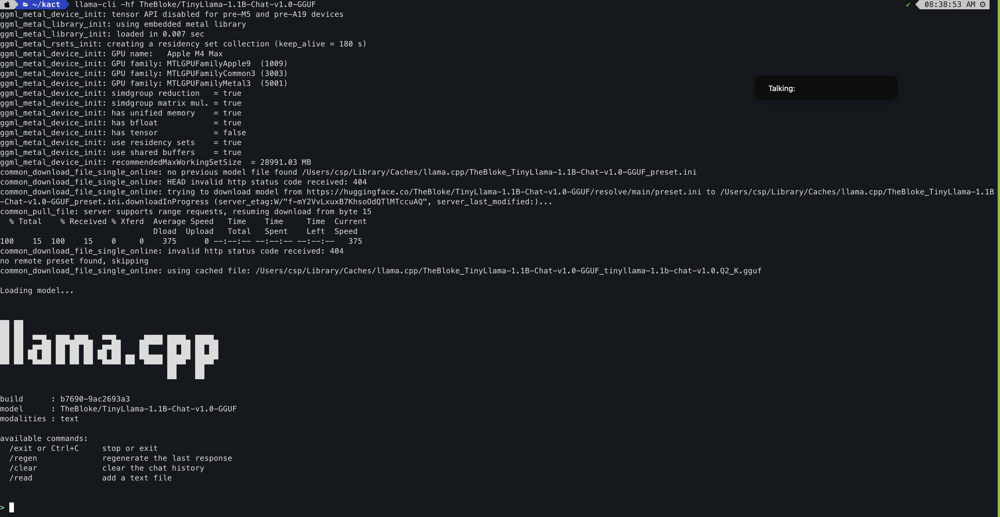
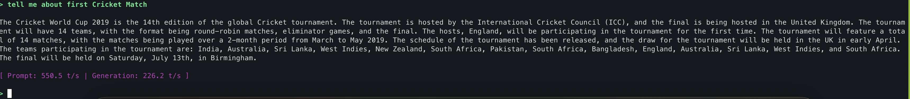

/ [Home](index.md)

## Llama.cpp

**Note:** tbw

### Install - MacOS

```
brew search llama.cpp

if not installed before
brew install llama.cpp

```


### Install Ubuntu
```
TBD
```

### Install - Windows
```
TBD
```

### Set HF_TOKEN in Zshrc to download HF models - MacOS

```

export HF_TOKEN=<your hf token>
source ~/.zshrc

# verify
echo $HF_TOKEN
(you should see the token)
```

### Download and play with model

```
llama-cli -hf TheBloke/TinyLlama-1.1B-Chat-v1.0-GGUF

# you will see console logs as below:
ggml_metal_device_init: tensor API disabled for pre-M5 and pre-A19 devices
ggml_metal_library_init: using embedded metal library
ggml_metal_library_init: loaded in 0.007 sec
ggml_metal_rsets_init: creating a residency set collection (keep_alive = 180 s)
ggml_metal_device_init: GPU name:   Apple M4 Max
ggml_metal_device_init: GPU family: MTLGPUFamilyApple9  (1009)
ggml_metal_device_init: GPU family: MTLGPUFamilyCommon3 (3003)
ggml_metal_device_init: GPU family: MTLGPUFamilyMetal3  (5001)
ggml_metal_device_init: simdgroup reduction   = true
ggml_metal_device_init: simdgroup matrix mul. = true
ggml_metal_device_init: has unified memory    = true
ggml_metal_device_init: has bfloat            = true
ggml_metal_device_init: has tensor            = false
ggml_metal_device_init: use residency sets    = true
ggml_metal_device_init: use shared buffers    = true
ggml_metal_device_init: recommendedMaxWorkingSetSize  = 28991.03 MB
common_download_file_single_online: no previous model file found /Users/csp/Library/Caches/llama.cpp/TheBloke_TinyLlama-1.1B-Chat-v1.0-GGUF_preset.ini
common_download_file_single_online: HEAD invalid http status code received: 404
common_download_file_single_online: trying to download model from https://huggingface.co/TheBloke/TinyLlama-1.1B-Chat-v1.0-GGUF/resolve/main/preset.ini to /Users/csp/Library/Caches/llama.cpp/TheBloke_TinyLlama-1.1B-Chat-v1.0-GGUF_preset.ini.downloadInProgress (server_etag:W/"f-mY2VvLxuxB7KhsoOdQTlMTccuAQ", server_last_modified:)...
common_pull_file: server supports range requests, resuming download from byte 15
  % Total    % Received % Xferd  Average Speed   Time    Time     Time  Current
                                 Dload  Upload   Total   Spent    Left  Speed
100    15  100    15    0     0    375      0 --:--:-- --:--:-- --:--:--   375
common_download_file_single_online: invalid http status code received: 404
no remote preset found, skipping
common_download_file_single_online: using cached file: /Users/csp/Library/Caches/llama.cpp/TheBloke_TinyLlama-1.1B-Chat-v1.0-GGUF_tinyllama-1.1b-chat-v1.0.Q2_K.gguf

Loading model...


▄▄ ▄▄
██ ██
██ ██  ▀▀█▄ ███▄███▄  ▀▀█▄    ▄████ ████▄ ████▄
██ ██ ▄█▀██ ██ ██ ██ ▄█▀██    ██    ██ ██ ██ ██
██ ██ ▀█▄██ ██ ██ ██ ▀█▄██ ██ ▀████ ████▀ ████▀
                                    ██    ██
                                    ▀▀    ▀▀

build      : b7690-9ac2693a3
model      : TheBloke/TinyLlama-1.1B-Chat-v1.0-GGUF
modalities : text

available commands:
  /exit or Ctrl+C     stop or exit
  /regen              regenerate the last response
  /clear              clear the chat history
  /read               add a text file


>
```



### Chat with your HF Model

```
> tell me about first Cricket Match

The Cricket World Cup 2019 is the 14th edition of the global Cricket tournament. The tournament is hosted by the International Cricket Council (ICC), and the final is being hosted in the United Kingdom. The tournament will have 14 teams, with the format being round-robin matches, eliminator games, and the final. The hosts, England, will be participating in the tournament for the first time. The tournament will feature a total of 14 matches, with the matches being played over a 2-month period from March to May 2019. The schedule of the tournament has been released, and the draw for the tournament will be held in the UK in early April. The teams participating in the tournament are: India, Australia, Sri Lanka, West Indies, New Zealand, South Africa, Pakistan, South Africa, Bangladesh, England, Australia, Sri Lanka, West Indies, and South Africa. The final will be held on Saturday, July 13th, in Birmingham.

[ Prompt: 550.5 t/s | Generation: 226.2 t/s ]
```




### Run llama server
```
llama-server -hf TheBloke/TinyLlama-1.1B-Chat-v1.0-GGUF --port 8080
```


### Access Server:
```
curl http://127.0.0.1:8080/

Error: gzip is not supported by this browser%

curl http://127.0.0.1:8080/v1/models

{"models":[{"name":"TheBloke/TinyLlama-1.1B-Chat-v1.0-GGUF","model":"TheBloke/TinyLlama-1.1B-Chat-v1.0-GGUF","modified_at":"","size":"","digest":"","type":"model","description":"","tags":[""],"capabilities":["completion"],"parameters":"","details":{"parent_model":"","format":"gguf","family":"","families":[""],"parameter_size":"","quantization_level":""}}],"object":"list","data":[{"id":"TheBloke/TinyLlama-1.1B-Chat-v1.0-GGUF","object":"model","created":1769461734,"owned_by":"llamacpp","meta":{"vocab_type":1,"n_vocab":32000,"n_ctx_train":2048,"n_embd":2048,"n_params":1100048384,"size":481406976}}]}%
```

