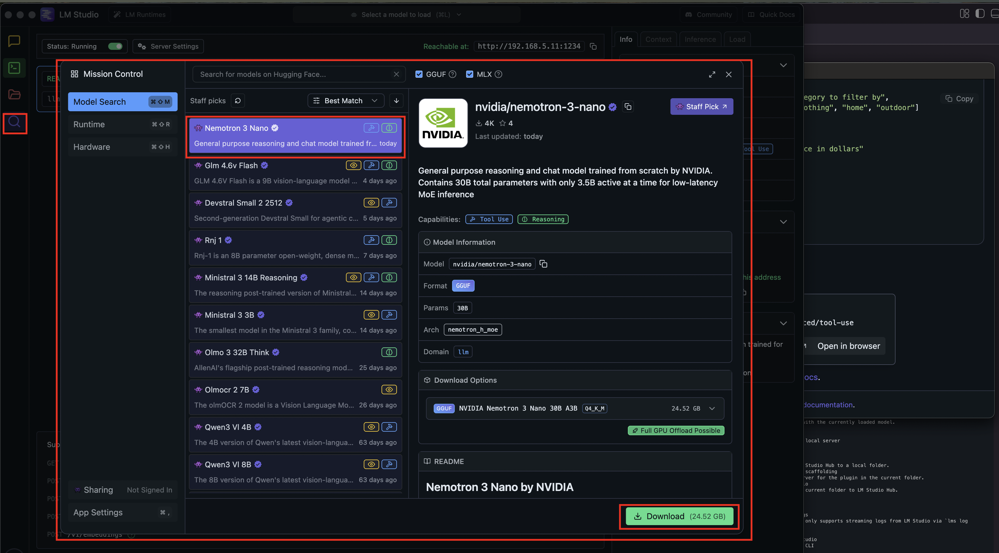
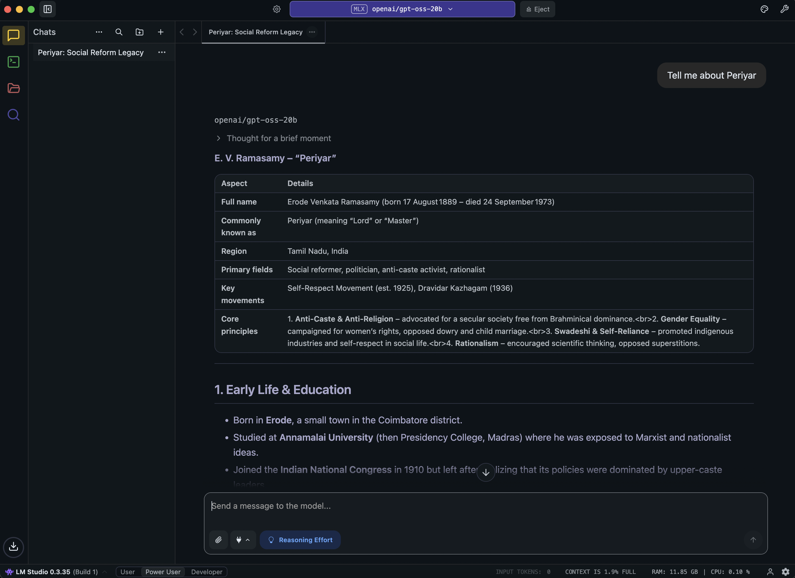
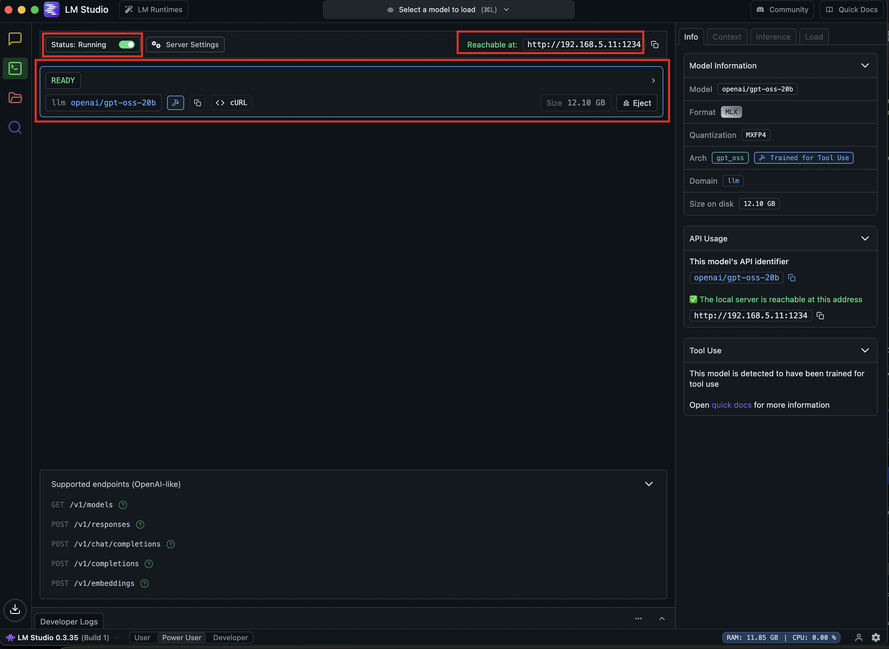
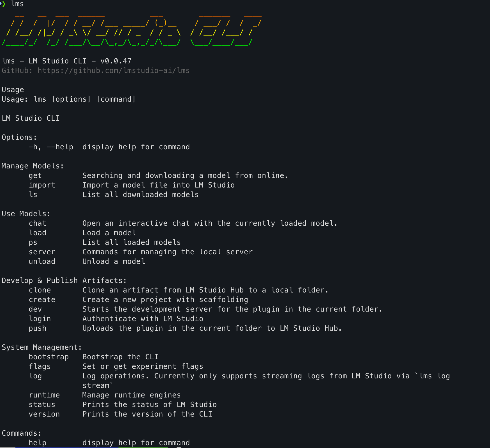

/ [Home](index.md)

## LM Studio Commands

### Installation
Download from [https://lmstudio.ai/](https://lmstudio.ai/) open up the UI


### Download Models via UI


### Chat on UI


### Developer Options


### CLI
```
lms

(see screenshot)
```



Ref:
- [https://lmstudio.ai/docs/advanced/tool-use](https://lmstudio.ai/docs/advanced/tool-use)
- [https://lmstudio.ai/docs](https://lmstudio.ai/docs)