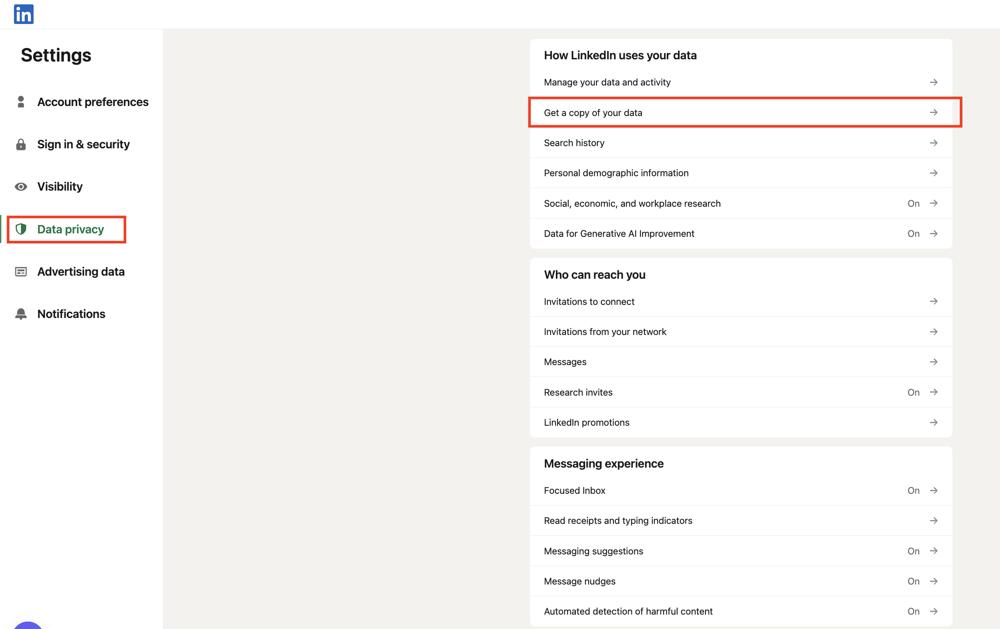
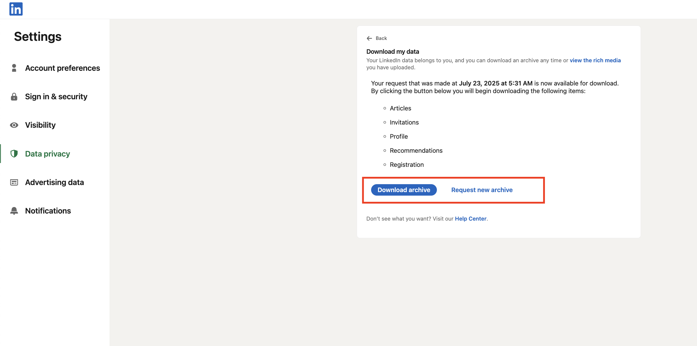

/ [Home](index.md)

## My LinkedIn Data

**Note:** How to get your own Data from LinkedIn

1. Log in to LinkedIn and go to Settings & Privacy.

2. Go to Data Privacy

3. Find Get a copy of your data and select Connections.

4. It will take 1 or 2 days to get your data