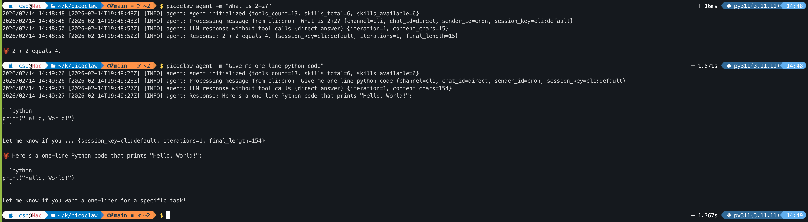
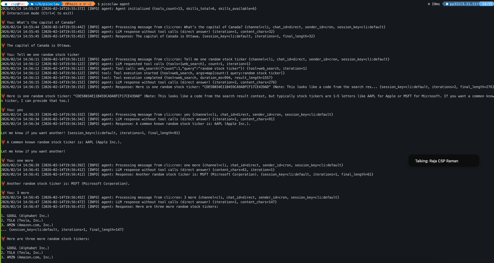
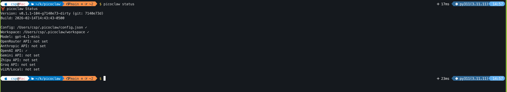

/ [Home](index.md)

## Picoclow


## Setup: Go - Mac
```
brew update
brew install go

go version
go version go1.26.0 darwin/arm64
```


### Setup - Picoclaw
```
git clone https://github.com/sipeed/picoclaw.git

cd picoclaw
make deps

# Build for multiple platforms
make build-all

# Build And Install
make install

picoclaw onboard
```


### Update settings
```
/Users/csp/.picoclaw/config.json

"agents": {
    "defaults": {
      "workspace": "~/.picoclaw/workspace",
      "restrict_to_workspace": true,
      "provider": "openai",
      "model": "gpt-4.1-mini",
      "max_tokens": 8192,
      "temperature": 0.7,
      "max_tool_iterations": 20
    }
  }
```







