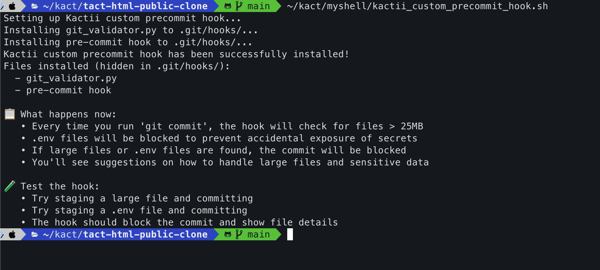

/ [Home](index.md)

## Precommit Validator

**Note:** tbw


### If you don't have Myshell folder in local, do this
```
cd ~/kact
git clone git@github.com:kactlabs/myshell.git
```

### Get into your desired folder
```
cd ~/kact/{your-desired-folder}

~/kact/myshell/kactii_custom_precommit_hook.sh
```

### You should see something like this
```
Setting up Kactii custom precommit hook...
Installing git_validator.py to .git/hooks/...
Installing pre-commit hook to .git/hooks/...
Kactii custom precommit hook has been successfully installed!
Files installed (hidden in .git/hooks/):
  - git_validator.py
  - pre-commit hook

📋 What happens now:
   • Every time you run 'git commit', the hook will check for files > 25MB
   • .env files will be blocked to prevent accidental exposure of secrets
   • If large files or .env files are found, the commit will be blocked
   • You'll see suggestions on how to handle large files and sensitive data

🧪 Test the hook:
   • Try staging a large file and committing
   • Try staging a .env file and committing
   • The hook should block the commit and show file details
```



This will avoid committing .env or big file into our repo.