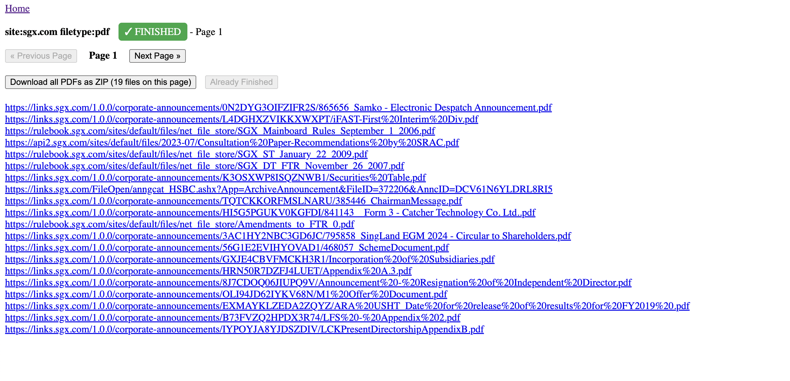

/ [Home](index.md)

## Random PDF Collection

**Note:** Collect Random PDFs


### How to?
```
git clone git@github.com:kactlabs/brave-search-custom.git

# update .env

python app.py

# check http://0.0.0.0:8899/ 
```


### Sample websites:
```
# United States
https://www.sec.gov
https://www.federalreserve.gov
https://www.fdic.gov
https://www.fhfa.gov
https://www.cbo.gov
https://www.cftc.gov
https://www.treasury.gov
https://www.bls.gov
https://www.bea.gov
https://www.census.gov
https://www.nyse.com
https://www.nasdaq.com
https://www.cmegroup.com

# Canada
https://www.bankofcanada.ca
https://www.fin.gc.ca
https://www.osc.ca
https://www.fcac-acfc.gc.ca
https://www.statcan.gc.ca
https://www.tsx.com

# United Kingdom
https://www.bankofengland.co.uk
https://www.ons.gov.uk
https://www.fca.org.uk
https://www.londonstockexchange.com

# Australia
https://www.rba.gov.au
https://www.abs.gov.au
https://www.apra.gov.au
https://www.asic.gov.au
https://www.asx.com.au

# New Zealand
https://www.rbnz.govt.nz
https://www.stats.govt.nz
https://www.fma.govt.nz
https://www.nzx.com

# Singapore
https://www.mas.gov.sg
https://www.singstat.gov.sg
https://www.sgx.com


# United States
site:sec.gov filetype:pdf
site:federalreserve.gov filetype:pdf
site:fdic.gov filetype:pdf
site:fhfa.gov filetype:pdf
site:cbo.gov filetype:pdf
site:cftc.gov filetype:pdf
site:treasury.gov filetype:pdf
site:bls.gov filetype:pdf
site:bea.gov filetype:pdf
site:census.gov filetype:pdf
(done above)


site:nyse.com filetype:pdf
site:nasdaq.com filetype:pdf
site:cmegroup.com filetype:pdf

# Canada
site:bankofcanada.ca filetype:pdf
site:fin.gc.ca filetype:pdf
site:osc.ca filetype:pdf
site:fcac-acfc.gc.ca filetype:pdf
site:statcan.gc.ca filetype:pdf
site:tsx.com filetype:pdf

# United Kingdom
site:bankofengland.co.uk filetype:pdf
site:ons.gov.uk filetype:pdf
site:fca.org.uk filetype:pdf
site:londonstockexchange.com filetype:pdf

# Australia
site:rba.gov.au filetype:pdf
site:abs.gov.au filetype:pdf
site:apra.gov.au filetype:pdf
site:asic.gov.au filetype:pdf
site:asx.com.au filetype:pdf

# New Zealand
site:rbnz.govt.nz filetype:pdf
site:stats.govt.nz filetype:pdf
site:fma.govt.nz filetype:pdf
site:nzx.com filetype:pdf

# Singapore
site:mas.gov.sg filetype:pdf
site:singstat.gov.sg filetype:pdf
site:sgx.com filetype:pdf

```

### Screenshots
