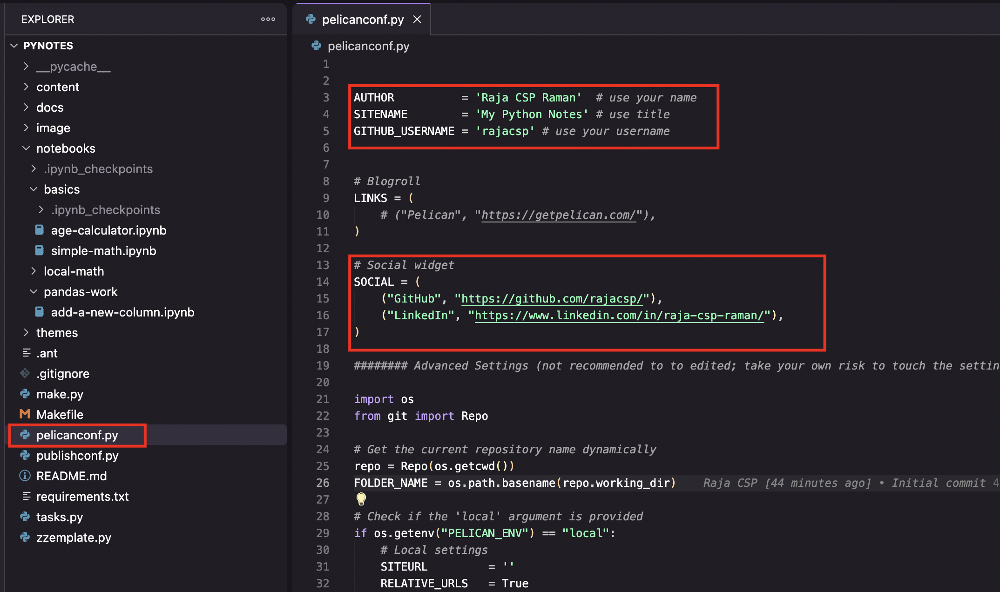
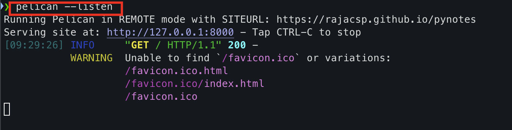
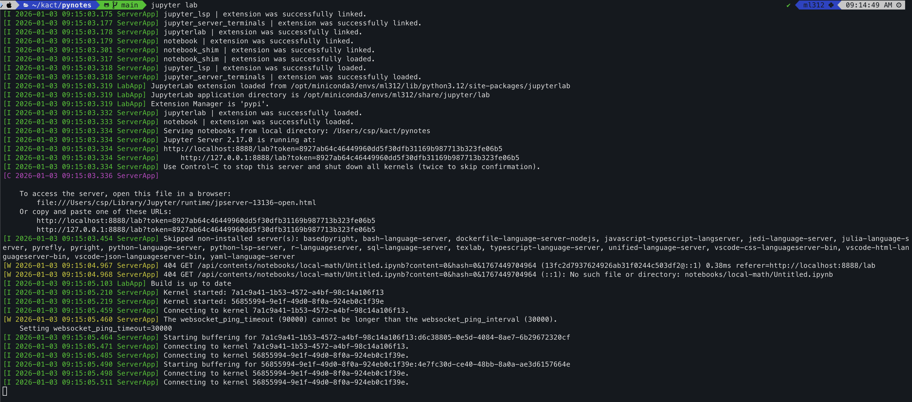
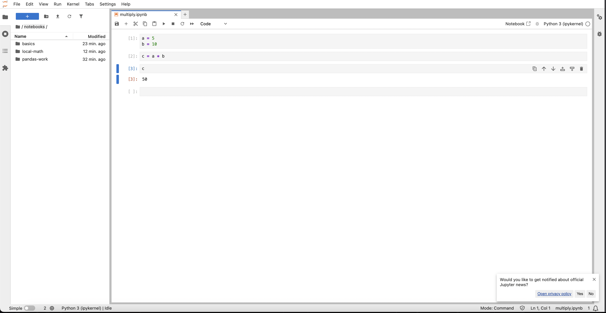
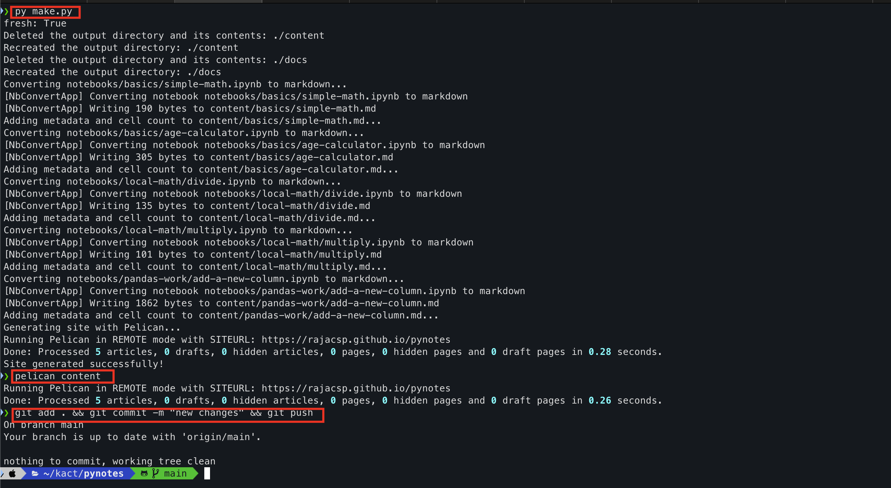
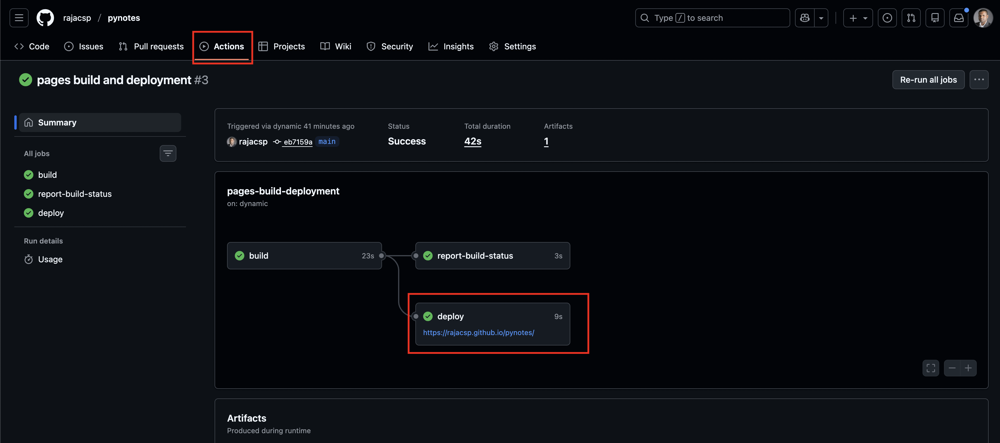

/ [Home](index.md)

## SigPy

**Note:** Sigte Generator Python


### 1. How to setup?
```
1. Go to this url
    https://github.com/kactlabs/sigpy

2. Create a new repository under "Use this template" option

3. Choose create new repository and name the repository

4. Our recommended name for your repository: pynotes

5. Git clone the newly created repo
```


### 2. Install requirements
```
pip install -r requirements.txt

# also install jupyter lab as you need it later
pip install jupyterlab

# verify jupyter lab
jupyter lab --version
```


### 3. PyNotes Configuration Setup 
```
1.go to pelicanconf.py

change the necessary changes to update:
    AUTHOR          : (your name)
    SITENAME        : (My Python Notes)
    GITHUB_USERNAME : (Your username)


Go to `# Social widget` and update your social links
SOCIAL = (
    ("GitHub", "<your github link>"),
    ("LinkedIn", "<your linkedin link>"),
) 

```
Sample:



### 4. Verify Local Server
```
python make.py

PELICAN_ENV=local pelican content

pelican --listen
    this will run the local server
    http://127.0.0.1:8000
```

You should see like this:



### Setup Jupyter Lab
```
pip install jupyterlab

# verify 
jupyter lab --version

jupyter lab
```
You will see like this:


You will see Jupyter Lab on browser:



### Create Sample file 
```
Create notebooks folder (leave it if it is already created)

And add any other folder related to your work 

And do the assignments in jupyter lab (needs installation of jupyterlab) by running the command: jupyter lab

Once done follow the below steps

```

### How to push your changes?
```
1. py make.py

2. pelican content

3. git add . && git commit -m "new changes" && git push
```

### Screenshot



### How to publish Changes
```
python make.py

pelican content

go to GitHub -> Pages -> Source

select "Deploy from  branch"

Go to branch on the same page

select "main" branch and "docs" folder
```


### Important Note
```
Once you are set and started to work

After every 5 files you have to publish the changes
```


### Get Archive Link
```
Once you push your changes

Go to your repository -> Pynotes -> Actions -> pages-build-deployment -> Get the deploy link
```
### Sample


