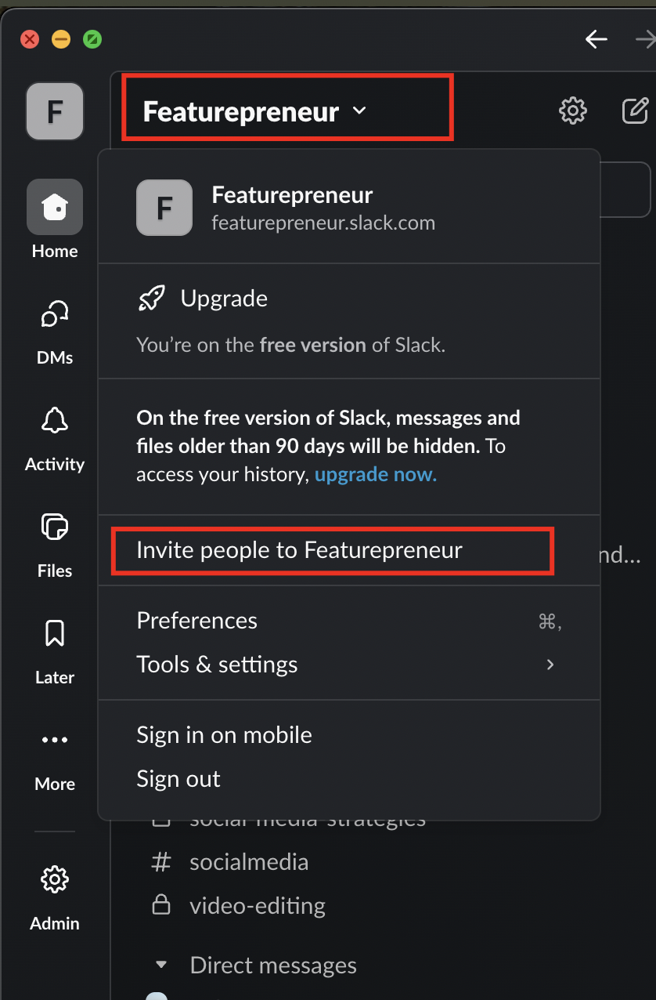
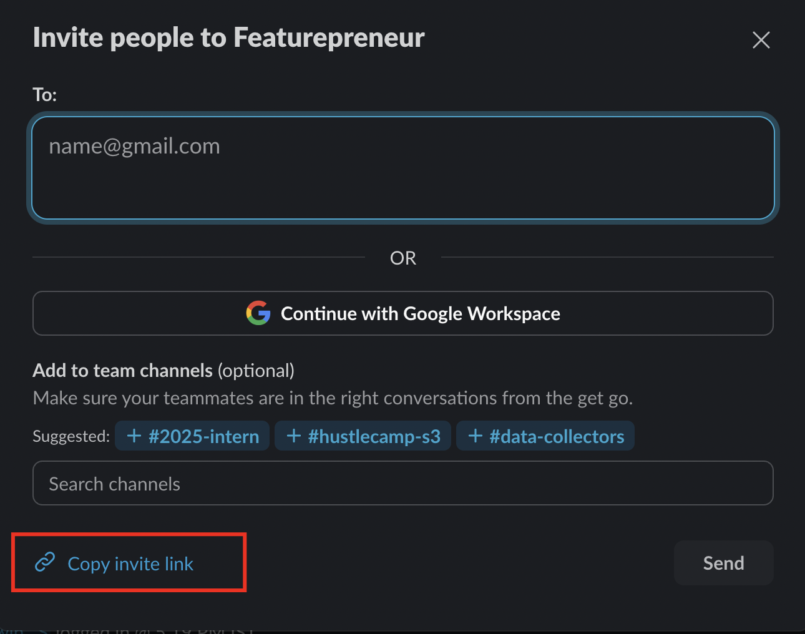
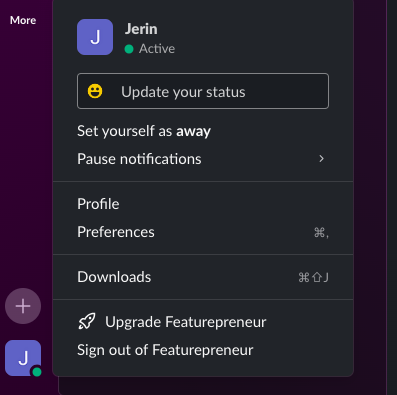
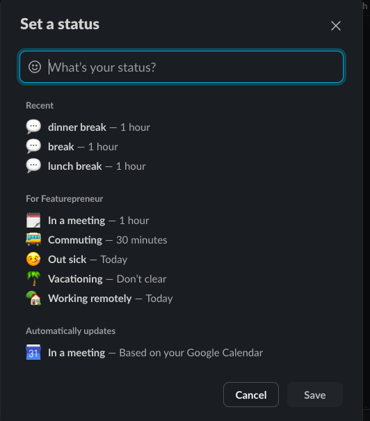
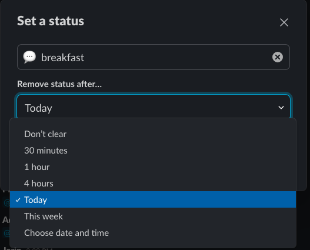

/ [Home](index.md)

## Slack Setup and Rules

### How to send an inviation?

Go to Inviation Section 


Generate Link



### Slack Rules

```
- Everyone must reply messages in Slack
- Everyone must inform their dayoff in Core-team or in the Group you are requested to 

```
 * When you are starting your work you have to mention in the group that i am logging in look at the image below

 
 * You have to do the same when you are logging out.

 * whenever you are taking break mention in the group

 

 * like the same you have to mention when you are taking a lunch break and also you have to mention when you are comming back after lunch

 

 * like this same mention for every break and for your personal emergency break you message on slack and go.

 * And you also should update your profile and set the break updates

 

* left side bottom corner click on your profile and click on the update your status



* In here you can mention the reason for your break and set the timing as shown in the image.if you want to customize the time click on "Choose date and time" and set the time

