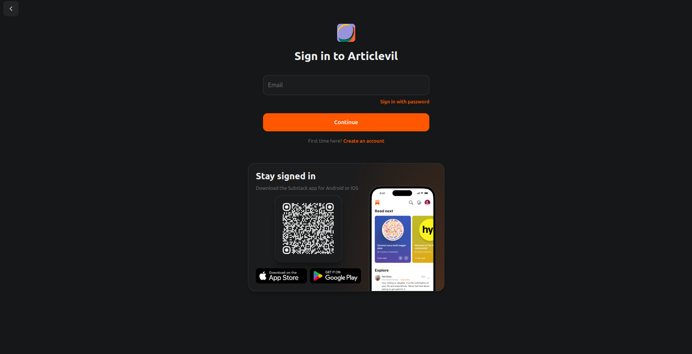
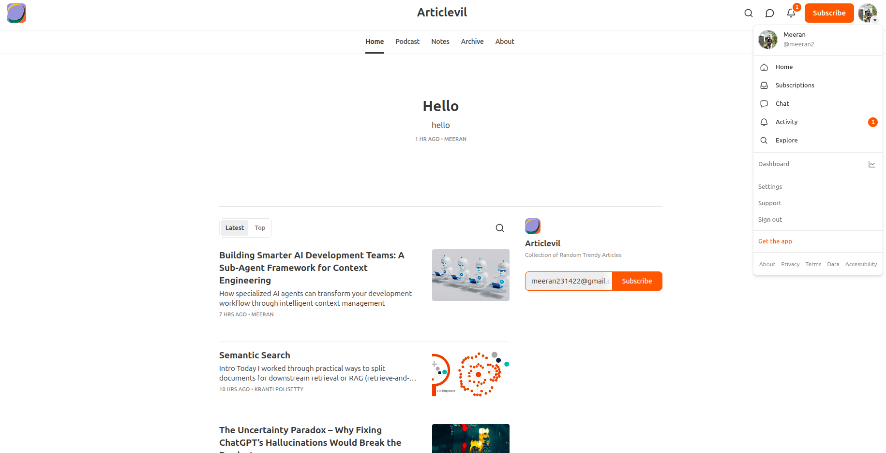
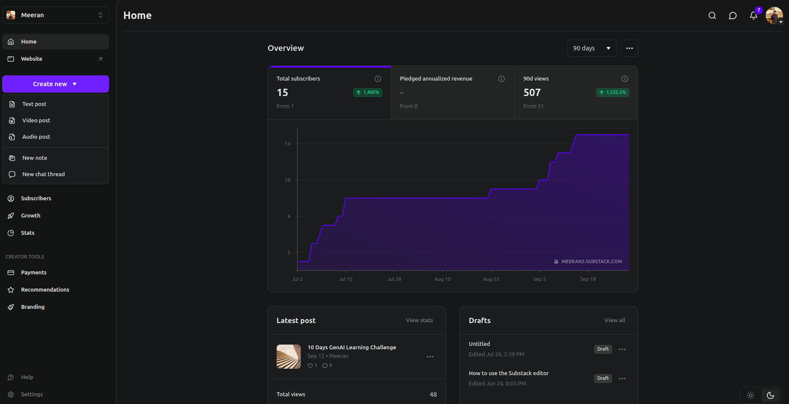
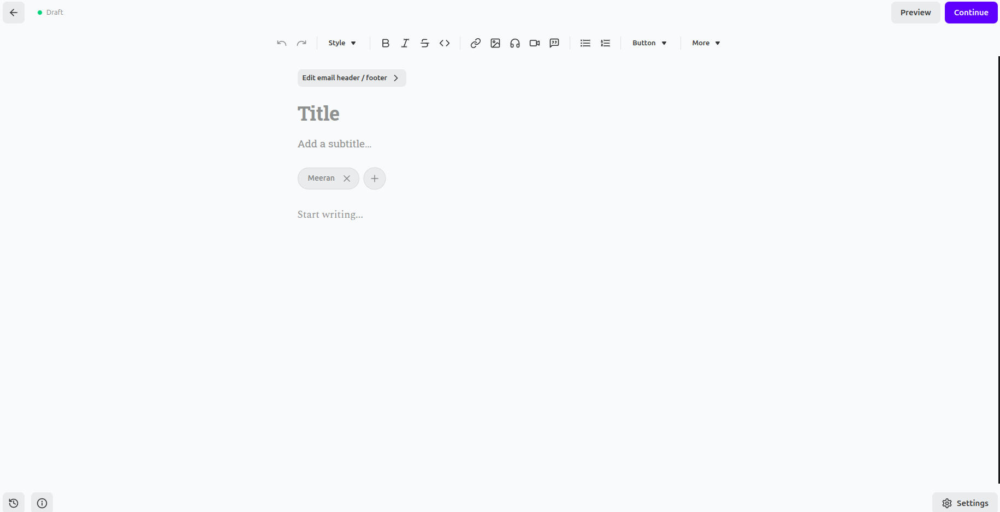
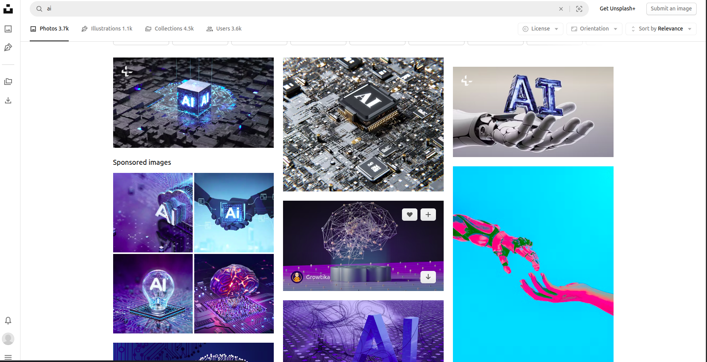
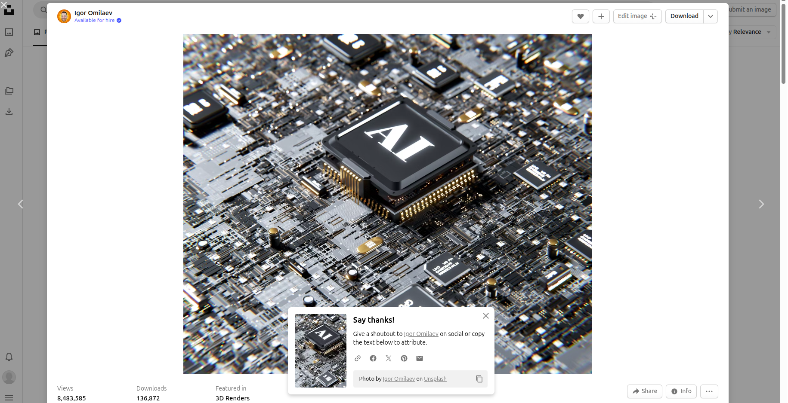
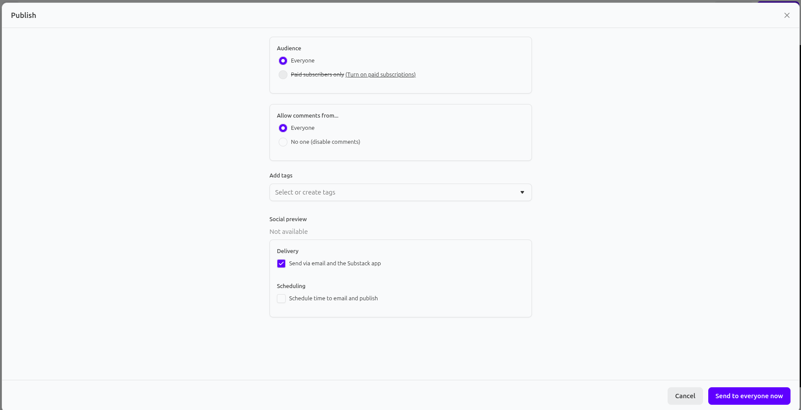
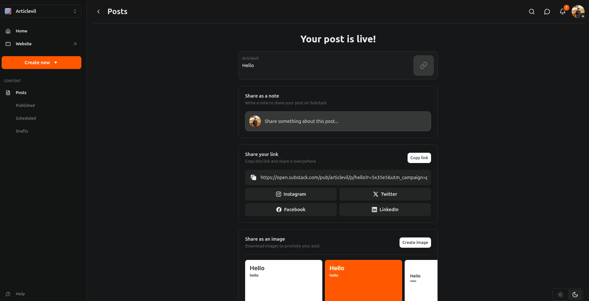

# How to Publish and Share Your Substack Link

This guide outlines the steps to publish an article on Substack and obtain a shareable link.

1.  **Access Substack:** Log in or sign up to your Substack account.

2.  **Go to Dashboard:** Click your profile icon and select "Dashboard."

3.  **Start New Post:** From the left sidebar, click "Create new" and choose "Text post."

4.  **Compose Article:** Write your article on the creation page.

5.  **Insert Images:** Only use images from Unsplash or your own creations.

6.  **Credit Unsplash Images:** When using Unsplash images, edit the caption to credit the creator.

7.  **Proceed to Publish:** Click "Continue" at the top right.

8.  **Set Publishing Options:** Define your audience, comment settings, add relevant tags, and select delivery preferences.

9.  **Publish Article:** Click "Send to everyone now" at the bottom right.

10. **Copy Shareable Link:** On the next page, find the "Share your link" section and click "Copy link."

