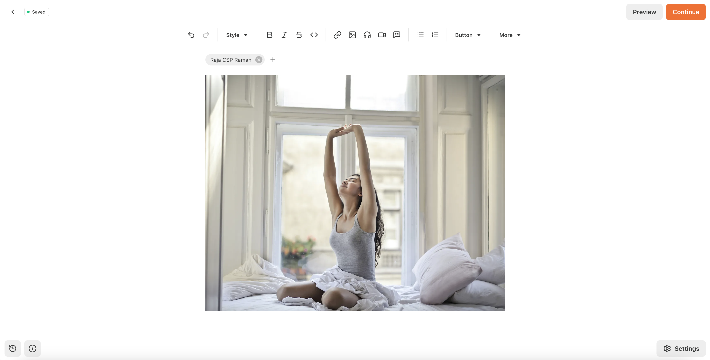
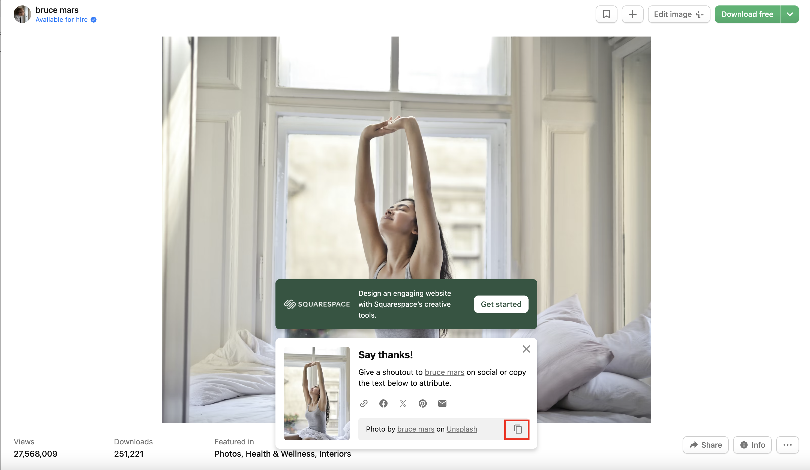
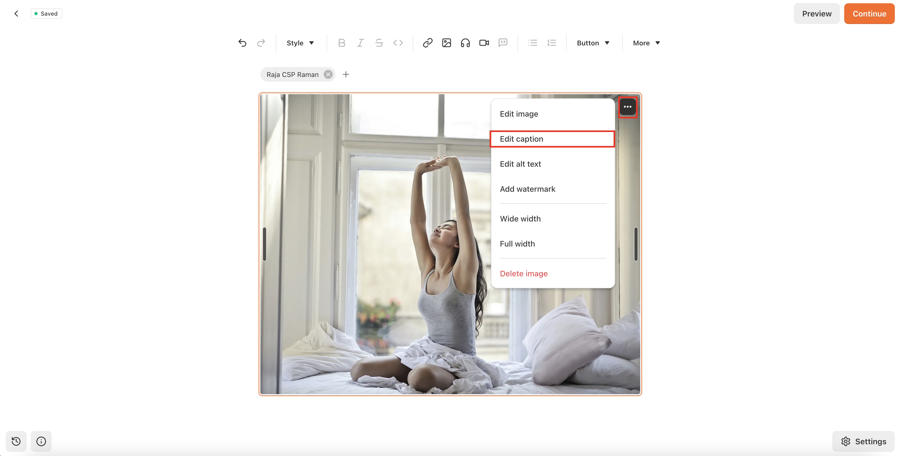
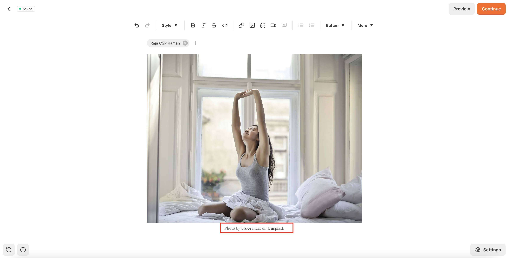
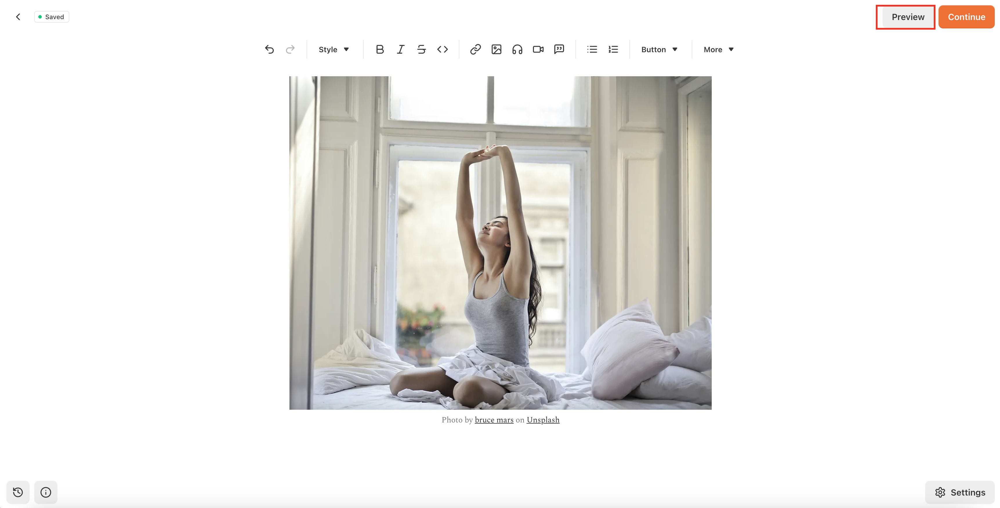
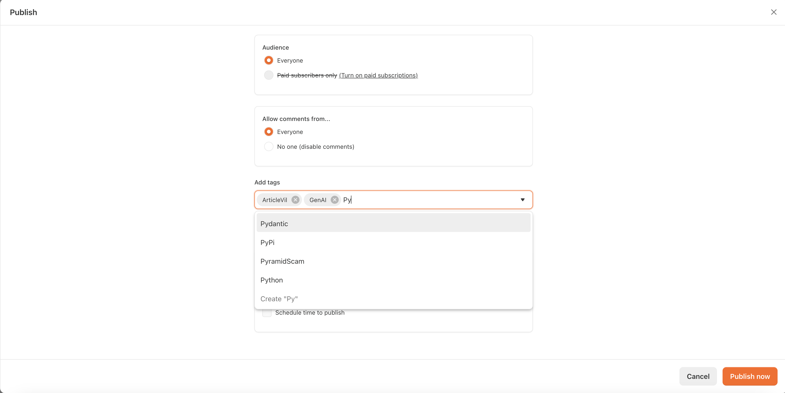

/ [Home](index.md)

## Substack

**Note:** Stack your knowledge on the web!

### How to publish on Substack?
1. Alwase get a picture from [Unsplash](https://unsplash.com/s/photos/test?orientation=landscape&license=free) 
  
    1.1. Add a picture like below
  

2. Get Picture Author details from Unsplash
  

3. Click Caption on the image
  

4. Add the Author details in caption
  

4. Add the rest of the contents in your Substack article page

5. Once you finished adding your content, check preview
  

6. Click `Continue` and add necessary tags 
  

7. Click `Publish Now` and it will be published

### How to make table in Substack?
1. Go to https://www.datawrapper.de/
2. Make table and publish
3. Copy paste the link in Substack and it will automatically pick up