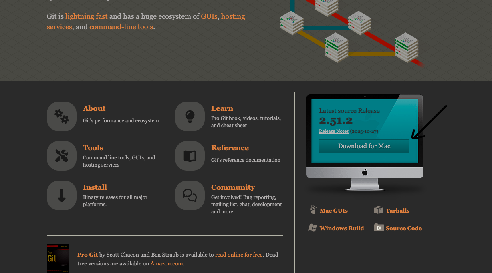
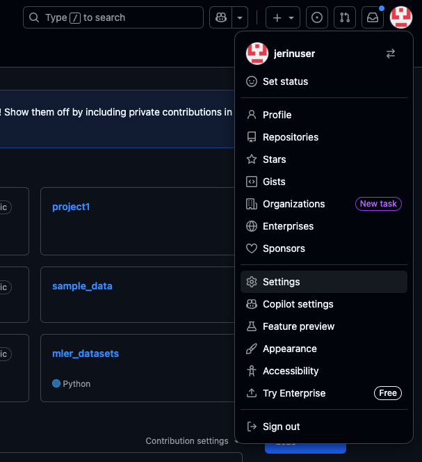
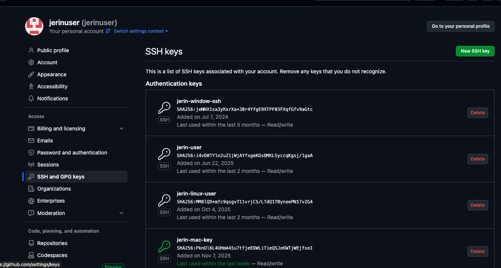
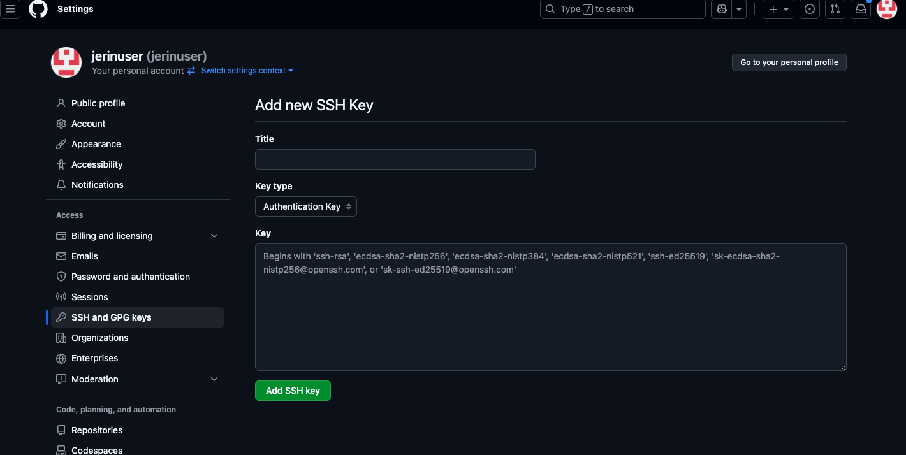
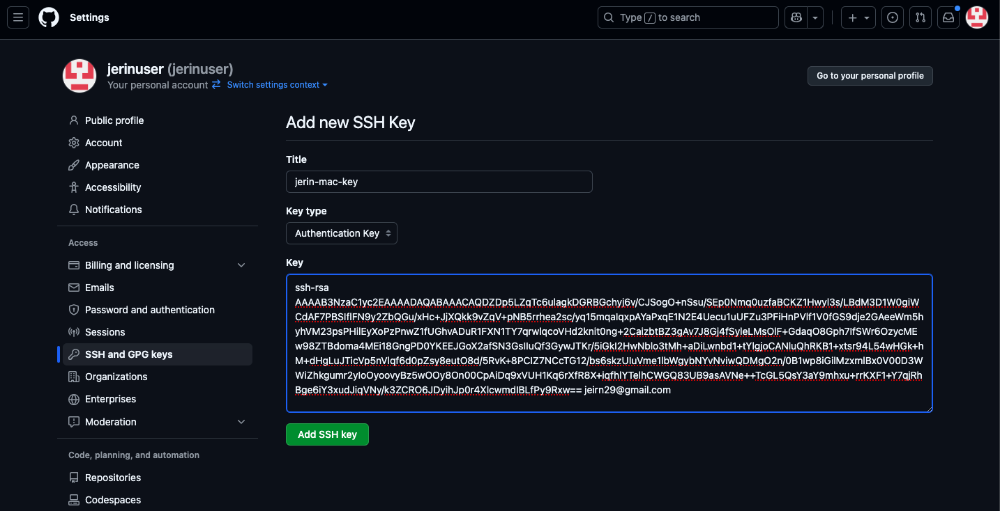
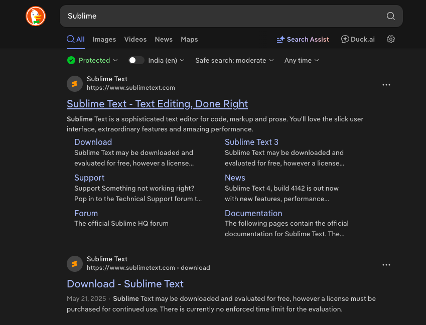

/ [Home](index.md)

# Windows Basic Setup

## Install Browser

* Install Brave browser do not use the chrome 

## join slack

 * first join the slack using the invite link.
 * Use your email and login 

## Install Git SCM  

 * go to this link and download it [Git SCM](https://git-scm.com/)
 
 

 * Choose according to your OS

 * Once installed open the installed file and finish the basic setup

## Setup SSH key in Github

 * once you setup the gitbash open the git bash and do the following steps 

 * paste the following commands on gitbash


 ```
git config --global user.name "Your Name"
git config --global user.email "your.email@example.com"
```

 * instead of "Your Name" and "your.email@example.com" replace with your github user name and email

 * after this use the below commands 

 ```
ssh-keygen -t rsa -b 4096 -C "your_email@example.com"

eval $(ssh-agent -s)

ssh-add ~/.ssh/id_rsa

cat ~/.ssh/id_rsa.pub
 ```

 * in this also replace with your email for the first command
 * once you enter the first command keep on pressing the enter 
 * after that paste the next commands one by one
 * once you enter the last command you will get ssh key as a result copy the key and store it in the txt file


## paste the ssh key in the github

* Go to github and click on your profile in the right side and choose settings 



* Once you click on the settings choose SSH and GPG Keys option in the left menu



* after clicking on it give a title for your key and paste your ssh key in the respective fields

Before



After



* After you done all these step click on add SSH key

That's you are done with the SSH key setup now you can start working with the github repo 

*Note*

All the github related work like git pull and git clone works only on the gitbash.(you can not do that in the in the normal terminal so make sure you are doing the things correctly)


## Install Sublime 

* search for Sublime in the browser and dowload it



* Once you dowload open the sublime and create a file called "dl-yourname.txt" sample "dl-jerin.txt"

* you have to store your daily logs in it use the format that is given below do not change the format

```
--------------------------------------------------
Day # 1 - Oct 12, 2025 - Tuesday
------------------------------------------


------------------------
```

* sample 

```
-------------------------------------------------------------------------------------------------------------------
Day # 313 September 9 2025 - Sunday
2025-11-09 10:00:46
---------------------------------------

LangChain vs LangGraph
https://www.youtube.com/watch?v=vmy3HgaKJsY

LangGraph Core Concepts
https://www.youtube.com/watch?v=D5KhiCDM9XQ

https://www.youtube.com/watch?v=CnXdddeZ4tQ
https://www.youtube.com/watch?v=qaWOwbFw3cs


https://jerins-organization.gitbook.io/my-learnings/


Generative AI vs Agentic AI
What is Agentic AI
LangChain vs LangGraph
LangGraph Core Concepts
Sequential Workflows in LangGraph
Parallel Workflows in LangGraph
Conditional Workflows in LangGraph
Iterative Workflows in LangGraph
How to Build a Chatbot using LangGraph
Persistence in LangGraph | Time Travel in LangGraph
Building a Chatbot with UI in LangGraph & Streamlit
Streaming in LangGraph – Implementing real-time streaming workflows
How to Build a Resume Chat Feature like ChatGPT
LangGraph + SQLite – Chatbot with Database Integration
LangSmith Crash Course – LangSmith tutorial and observability in GenAI
Observability in LangGraph – LangSmith integration for monitoring workflows
Tools in LangGraph – Tool use and orchestration in LangGraph


----------------------------------------/
```

* Create another file as logs.txt and store your effort logs in it 

* logs.txt file sample 
```
Jerin
November 07
Task 1: basic setup                                              			   - L2 - Success - 10:00 - 12:00
Task 2: Langchain notes          											   - L2 - Success - 12:00 - 14:00
Task 3: kactii-hustlecamp-learning-analytic deployed in vercel                 - L2 - Success - 15:00 - 16:30
Task 4: kactii-hustlecamp-learning-analytic- Mongodb connection issue in vercel- L2 - Failure - 16:30 - 18:30 
Task 5: Select query performed in vercel deploment                             - L3 - Success - 18:30 - 21:30

Total Hours: 10 Hours

------------------------------------------------------------------------------------------------------------------
```
*Note*

In your daily you have to keep the task details and any meeting notes and resources and any references you are collecting while working 
but in the logs.txt you have to maintain only the Task Details 

* Create one more file and as error-archive.txt and store the errors you get while working

## Install VSCode 

* Download VSCode [VSCode](https://code.visualstudio.com/download)

* And download the extensions from the following link [Extensions](https://wiki.kactii.com/vscode-and-extensions.html) 

## Install miniconda 

* Click this link and download miniconda [miniconda](https://www.anaconda.com/download/success)

* once you download do the normal setup for the application and open it.

* And after that enter the below commands in the anaconda prompt

```
conda create --name py312 python=3.12
```
* The above command used to create a python 12 environment

* Use the "code" command in the anaconda prompt to open VSCode
 
 ## Install kiro 

 * download kiro [kiro](https://kiro.dev/)